# CivicMind AI — Backend Implementation Guide v2

> **Team:** Person 4 (Core Backend) + Person 5 (AI: Category + Duplicate) + Person 6 (AI: Priority + Sentiment + Recommendation)
> **Stack:** Python, FastAPI, MongoDB (via Motor), Sentence Transformers, scikit-learn
> **Goal:** Build a production-ready backend for a civic complaint management system with AI-powered analysis
> **Database:** MongoDB (NoSQL, document-based)

---

## Table of Contents

1. [System Architecture Overview](#1-system-architecture-overview)
2. [Project Structure](#2-project-structure)
3. [Tech Stack & Dependencies](#3-tech-stack--dependencies)
4. [Database Schema (MongoDB)](#4-database-schema-mongodb)
5. [Person 4 — Core Backend](#5-person-4--core-backend)
6. [Person 5 — Category Detection + Duplicate Detection](#6-person-5--category-detection--duplicate-detection)
7. [Person 6 — Priority + Sentiment + Recommendation](#7-person-6--priority--sentiment--recommendation)
8. [API Reference](#8-api-reference)
9. [Integration Contract](#9-integration-contract)
10. [Sequence Diagrams](#10-sequence-diagrams)
11. [Workflow Diagrams](#11-workflow-diagrams)
12. [Integration with Other Teams](#12-integration-with-other-teams)
13. [Development Phases & Timeline](#13-development-phases--timeline)
14. [Testing Strategy](#14-testing-strategy)
15. [Deployment & Runbook](#15-deployment--runbook)

---

## 1. System Architecture Overview

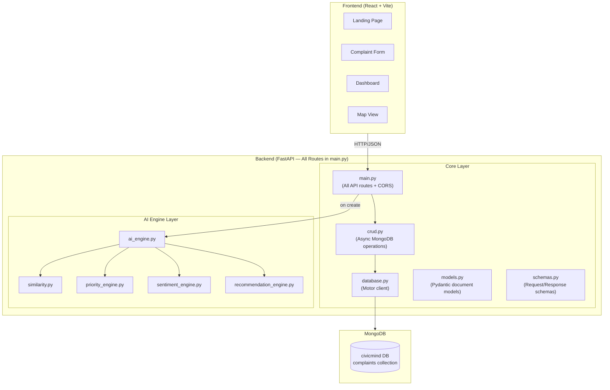

### High-Level Data Flow

```mermaid
flowchart LR
    A[Citizen Submits Complaint] --> B[Frontend validates form]
    B --> C[POST /api/complaints]
    C --> D[Person 4: Validate & insert into MongoDB]
    D --> E[Person 5 + 6: AI Analysis Pipeline]
    E --> F{Duplicate?}
    F -->|Yes| G[Flag as duplicate, link to parent]
    F -->|No| H[Continue]
    G --> I[Calculate Priority Score]
    H --> I
    I --> J[Generate Recommendation]
    J --> K[Update MongoDB document with AI fields]
    K --> L[Return full response to Frontend]
    L --> M[Show result to citizen]
    M --> N[Dashboard updates via GET /api/dashboard/*]
```

---

## 2. Project Structure

```
backend/
│
├── main.py                  # FastAPI app — ALL routes, CORS, startup, health check
├── database.py              # Motor async client, DB connection
├── models.py                # Pydantic document models (ComplaintDocument, etc.)
├── schemas.py               # Pydantic request/response schemas
├── crud.py                  # Async MongoDB CRUD operations
├── requirements.txt         # Python dependencies
│
├── ai_engine.py             # Orchestrator — calls all AI sub-modules
├── similarity.py            # Duplicate detection (sentence-transformers)
├── priority_engine.py       # Priority scoring logic
├── sentiment_engine.py      # Sentiment analysis
└── recommendation_engine.py # Action recommendation engine
```

### Ownership Map

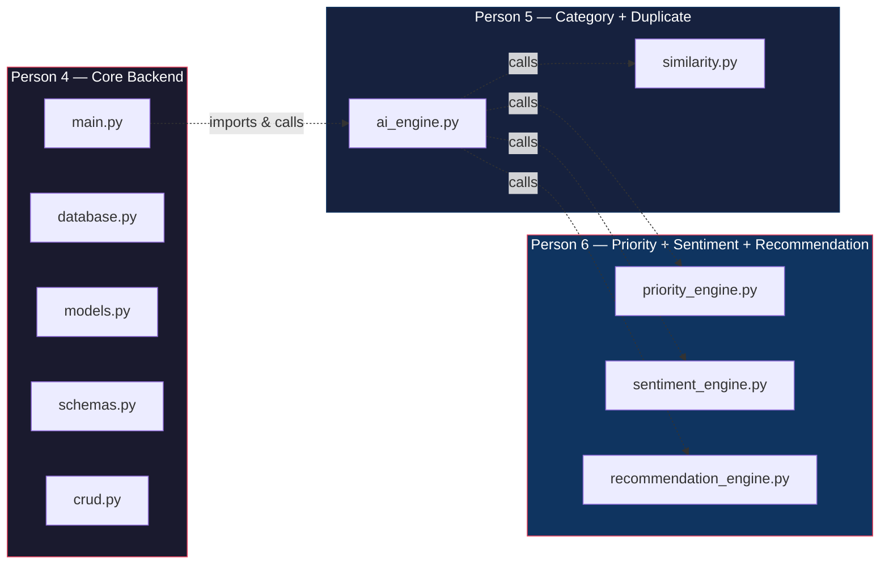

---

## 3. Tech Stack & Dependencies

### `requirements.txt`

```txt
# Core
fastapi==0.104.1
uvicorn[standard]==0.24.0
pydantic==2.5.2
python-multipart==0.0.6

# MongoDB
motor==3.3.2
pymongo==4.6.1

# AI/ML (Person 5 + Person 6)
sentence-transformers==2.2.2
scikit-learn==1.3.2
torch==2.1.0
numpy==1.26.2
```

### Installation

```bash
cd backend
pip install -r requirements.txt
```

### Prerequisites

- **MongoDB** must be running locally on `localhost:27017` (or set `MONGO_URI` env var)
- Install MongoDB: https://www.mongodb.com/docs/manual/installation/
- Or use MongoDB Atlas (cloud): free tier at https://www.mongodb.com/atlas

---

## 4. Database Schema (MongoDB)

### MongoDB Collection: `complaints`

Each document in the `complaints` collection follows this structure:

```json
{
    "_id": ObjectId("64a1b2c3d4e5f6a7b8c9d0e1"),
    "name": "Ravi Kumar",
    "title": "Large pothole on MG Road",
    "description": "There is a dangerous pothole near the college gate on MG Road. Multiple bikes have fallen here.",
    "category": "Road",
    "location_name": "MG Road, near City College",
    "latitude": 12.9716,
    "longitude": 77.5946,
    "status": "Pending",
    "priority_score": 72.5,
    "priority_level": "High",
    "sentiment": "Negative",
    "recommended_action": "Inspect the road within 24 hours. Place temporary warning signs and schedule repair within a week.",
    "is_duplicate": false,
    "duplicate_of": null,
    "similarity_score": 0.0,
    "created_at": "2026-08-20T10:30:00.000Z",
    "updated_at": "2026-08-20T10:30:00.000Z"
}
```

### Field Descriptions

| Field | MongoDB Type | Default | Owner | Description |
|-------|-------------|---------|-------|-------------|
| `_id` | `ObjectId` | auto | MongoDB | Auto-generated unique identifier |
| `name` | `string` | — | Person 4 | Citizen's name |
| `title` | `string` | — | Person 4 | Complaint title |
| `description` | `string` | — | Person 4 | Full complaint text |
| `category` | `string` | `"Unknown"` | **Person 5** | AI-detected category |
| `location_name` | `string` | — | Person 4 | Human-readable location |
| `latitude` | `double` | `None` | Person 4 | Map coordinate |
| `longitude` | `double` | `None` | Person 4 | Map coordinate |
| `status` | `string` | `"Pending"` | Person 4 | Pending / In Progress / Resolved |
| `priority_score` | `double` | `0.0` | **Person 6** | Calculated 0–100 score |
| `priority_level` | `string` | `"Low"` | **Person 6** | Low / Medium / High / Critical |
| `sentiment` | `string` | `"Neutral"` | **Person 6** | Neutral / Negative / Critical |
| `recommended_action` | `string` | `""` | **Person 6** | AI-generated action suggestion |
| `is_duplicate` | `bool` | `False` | **Person 5** | Whether flagged as duplicate |
| `duplicate_of` | `string` | `None` | **Person 5** | `_id` of parent complaint if duplicate |
| `similarity_score` | `double` | `0.0` | **Person 5** | Cosine similarity to parent |
| `created_at` | `datetime` | `utcnow` | Person 4 | Creation timestamp |
| `updated_at` | `datetime` | `utcnow` | Person 4 | Last update timestamp |

### MongoDB Indexes (Recommended)

```javascript
// Run in mongosh or MongoDB Compass
db.complaints.createIndex({ "category": 1 })
db.complaints.createIndex({ "status": 1 })
db.complaints.createIndex({ "priority_level": 1 })
db.complaints.createIndex({ "is_duplicate": 1 })
db.complaints.createIndex({ "created_at": -1 })
db.complaints.createIndex({ "latitude": 1, "longitude": 1 })
```

### Status Flow

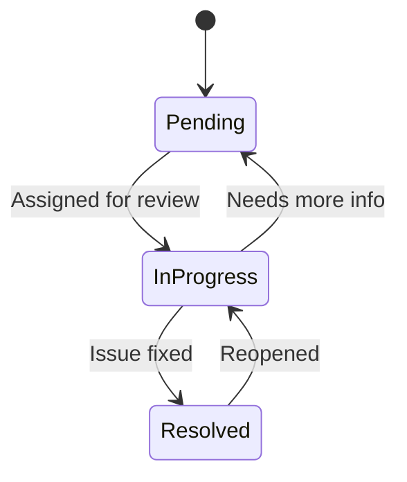

---

## 5. Person 4 — Core Backend

### 5.1 `database.py`

```python
import os
from motor.motor_asyncio import AsyncIOMotorClient

MONGO_URI = os.getenv("MONGO_URI", "mongodb://localhost:27017")
DB_NAME = os.getenv("DB_NAME", "civicmind")

client: AsyncIOMotorClient = None
db = None


async def connect_db():
    global client, db
    client = AsyncIOMotorClient(MONGO_URI)
    db = client[DB_NAME]
    # Create indexes
    await db.complaints.create_index("category")
    await db.complaints.create_index("status")
    await db.complaints.create_index("priority_level")
    await db.complaints.create_index("is_duplicate")
    await db.complaints.create_index("created_at")
    await db.complaints.create_index([("latitude", 1), ("longitude", 1)])
    print(f"Connected to MongoDB: {DB_NAME}")


async def close_db():
    global client
    if client:
        client.close()
        print("MongoDB connection closed")


def get_db():
    return db
```

### 5.2 `models.py`

```python
from datetime import datetime
from typing import Optional
from pydantic import BaseModel, Field
from bson import ObjectId


class PyObjectId(str):
    @classmethod
    def __get_validators__(cls):
        yield cls.validate

    @classmethod
    def validate(cls, v):
        if isinstance(v, ObjectId):
            return str(v)
        if isinstance(v, str) and len(v) == 24:
            return v
        raise ValueError("Invalid ObjectId")


class ComplaintDocument(BaseModel):
    id: PyObjectId = Field(default_factory=lambda: str(ObjectId()), alias="_id")
    name: str
    title: str
    description: str
    category: str = "Unknown"
    location_name: str
    latitude: Optional[float] = None
    longitude: Optional[float] = None
    status: str = "Pending"
    priority_score: float = 0.0
    priority_level: str = "Low"
    sentiment: str = "Neutral"
    recommended_action: str = ""
    is_duplicate: bool = False
    duplicate_of: Optional[str] = None
    similarity_score: float = 0.0
    created_at: datetime = Field(default_factory=datetime.utcnow)
    updated_at: datetime = Field(default_factory=datetime.utcnow)

    class Config:
        populate_by_name = True
        json_encoders = {ObjectId: str}


def complaint_doc_to_dict(doc: dict) -> dict:
    """Convert a MongoDB document to a flat dict for Pydantic response."""
    doc["id"] = str(doc.pop("_id"))
    if "duplicate_of" in doc and doc["duplicate_of"] is not None:
        doc["duplicate_of"] = str(doc["duplicate_of"])
    return doc
```

### 5.3 `schemas.py`

```python
from datetime import datetime
from typing import Optional
from pydantic import BaseModel


class ComplaintCreate(BaseModel):
    name: str
    title: str
    description: str
    location_name: str
    latitude: Optional[float] = None
    longitude: Optional[float] = None


class StatusUpdate(BaseModel):
    status: str


class ComplaintResponse(BaseModel):
    id: str
    name: str
    title: str
    description: str
    category: str
    location_name: str
    latitude: Optional[float]
    longitude: Optional[float]
    status: str
    priority_score: float
    priority_level: str
    sentiment: str
    recommended_action: str
    is_duplicate: bool
    duplicate_of: Optional[str]
    similarity_score: float
    created_at: datetime
    updated_at: datetime


class DashboardStats(BaseModel):
    total_complaints: int
    high_priority: int
    potential_duplicates: int
    resolved: int


class CategoryCount(BaseModel):
    category: str
    count: int


class PriorityCount(BaseModel):
    level: str
    count: int


class TrendPoint(BaseModel):
    date: str
    count: int


class AnalyticsResponse(BaseModel):
    category_distribution: list[CategoryCount]
    priority_distribution: list[PriorityCount]
    trend_data: list[TrendPoint]
```

### 5.4 `crud.py`

```python
from datetime import datetime, timedelta
from bson import ObjectId
from database import get_db


async def create_complaint(complaint_data: dict) -> dict:
    db = get_db()
    now = datetime.utcnow()
    doc = {
        **complaint_data,
        "category": "Unknown",
        "status": "Pending",
        "priority_score": 0.0,
        "priority_level": "Low",
        "sentiment": "Neutral",
        "recommended_action": "",
        "is_duplicate": False,
        "duplicate_of": None,
        "similarity_score": 0.0,
        "created_at": now,
        "updated_at": now,
    }
    result = await db.complaints.insert_one(doc)
    doc["_id"] = result.inserted_id
    return doc


async def get_complaint(complaint_id: str) -> dict | None:
    db = get_db()
    return await db.complaints.find_one({"_id": ObjectId(complaint_id)})


async def get_all_complaints(skip: int = 0, limit: int = 100) -> list[dict]:
    db = get_db()
    cursor = db.complaints.find().sort("created_at", -1).skip(skip).limit(limit)
    return await cursor.to_list(length=limit)


async def get_complaints_for_similarity() -> list[dict]:
    """Returns lightweight data for AI duplicate detection."""
    db = get_db()
    cursor = db.complaints.find(
        {"is_duplicate": False},
        {"_id": 1, "description": 1},
    )
    docs = await cursor.to_list(length=10000)
    return [{"id": str(d["_id"]), "description": d["description"]} for d in docs]


async def update_complaint_status(complaint_id: str, status: str) -> dict | None:
    db = get_db()
    await db.complaints.update_one(
        {"_id": ObjectId(complaint_id)},
        {"$set": {"status": status, "updated_at": datetime.utcnow()}},
    )
    return await get_complaint(complaint_id)


async def update_complaint_ai_fields(complaint_id: str, ai_result: dict) -> dict | None:
    db = get_db()
    ai_result["duplicate_of"] = (
        str(ai_result["duplicate_of"]) if ai_result.get("duplicate_of") else None
    )
    await db.complaints.update_one(
        {"_id": ObjectId(complaint_id)},
        {"$set": {**ai_result, "updated_at": datetime.utcnow()}},
    )
    return await get_complaint(complaint_id)


async def get_dashboard_stats() -> dict:
    db = get_db()
    total = await db.complaints.count_documents({})
    high_priority = await db.complaints.count_documents(
        {"priority_level": {"$in": ["High", "Critical"]}}
    )
    duplicates = await db.complaints.count_documents({"is_duplicate": True})
    resolved = await db.complaints.count_documents({"status": "Resolved"})
    return {
        "total_complaints": total,
        "high_priority": high_priority,
        "potential_duplicates": duplicates,
        "resolved": resolved,
    }


async def get_analytics() -> dict:
    db = get_db()

    # Category distribution
    cat_cursor = db.complaints.aggregate([
        {"$group": {"_id": "$category", "count": {"$sum": 1}}}
    ])
    cat_docs = await cat_cursor.to_list(length=50)
    category_dist = [{"category": d["_id"], "count": d["count"]} for d in cat_docs]

    # Priority distribution
    pri_cursor = db.complaints.aggregate([
        {"$group": {"_id": "$priority_level", "count": {"$sum": 1}}}
    ])
    pri_docs = await pri_cursor.to_list(length=50)
    priority_dist = [{"level": d["_id"], "count": d["count"]} for d in pri_docs]

    # Trend data (last 30 days)
    thirty_days_ago = datetime.utcnow() - timedelta(days=30)
    trend_cursor = db.complaints.aggregate([
        {"$match": {"created_at": {"$gte": thirty_days_ago}}},
        {"$group": {
            "_id": {"$dateToString": {"format": "%Y-%m-%d", "date": "$created_at"}},
            "count": {"$sum": 1},
        }},
        {"$sort": {"_id": 1}},
    ])
    trend_docs = await trend_cursor.to_list(length=30)
    trend_data = [{"date": d["_id"], "count": d["count"]} for d in trend_docs]

    return {
        "category_distribution": category_dist,
        "priority_distribution": priority_dist,
        "trend_data": trend_data,
    }


async def search_complaints(
    query: str = "", category: str = "", status: str = ""
) -> list[dict]:
    db = get_db()
    filter_query = {}
    if query:
        filter_query["$or"] = [
            {"title": {"$regex": query, "$options": "i"}},
            {"description": {"$regex": query, "$options": "i"}},
        ]
    if category:
        filter_query["category"] = category
    if status:
        filter_query["status"] = status

    cursor = db.complaints.find(filter_query).sort("created_at", -1)
    return await cursor.to_list(length=500)


async def get_map_complaints() -> list[dict]:
    db = get_db()
    cursor = db.complaints.find(
        {"latitude": {"$ne": None}, "longitude": {"$ne": None}},
        {
            "_id": 1, "title": 1, "category": 1,
            "priority_level": 1, "status": 1,
            "latitude": 1, "longitude": 1, "location_name": 1,
        },
    )
    docs = await cursor.to_list(length=10000)
    return [
        {
            "id": str(d["_id"]),
            "title": d["title"],
            "category": d["category"],
            "priority_level": d["priority_level"],
            "status": d["status"],
            "latitude": d["latitude"],
            "longitude": d["longitude"],
            "location_name": d["location_name"],
        }
        for d in docs
    ]
```

### 5.5 `main.py`

```python
from contextlib import asynccontextmanager
from fastapi import FastAPI, HTTPException, Query
from fastapi.middleware.cors import CORSMiddleware
from pydantic import BaseModel

from database import connect_db, close_db
from schemas import (
    ComplaintCreate, ComplaintResponse, StatusUpdate,
    DashboardStats, AnalyticsResponse,
)
from crud import (
    create_complaint, get_complaint, get_all_complaints,
    update_complaint_status, update_complaint_ai_fields,
    get_complaints_for_similarity, search_complaints,
    get_map_complaints, get_dashboard_stats, get_analytics,
)
from models import complaint_doc_to_dict
from ai_engine import analyze_complaint


@asynccontextmanager
async def lifespan(app: FastAPI):
    await connect_db()
    yield
    await close_db()


app = FastAPI(
    title="CivicMind AI",
    description="AI-powered civic complaint management system",
    version="1.0.0",
    lifespan=lifespan,
)

app.add_middleware(
    CORSMiddleware,
    allow_origins=["http://localhost:5173", "http://localhost:3000"],
    allow_credentials=True,
    allow_methods=["*"],
    allow_headers=["*"],
)


# ─── Health ───────────────────────────────────────────────

@app.get("/health")
async def health_check():
    return {"status": "healthy", "service": "CivicMind AI"}


@app.get("/")
async def root():
    return {"message": "CivicMind AI Backend", "docs": "/docs"}


# ─── Complaints ───────────────────────────────────────────

@app.post("/api/complaints", response_model=ComplaintResponse)
async def submit_complaint(complaint: ComplaintCreate):
    doc = await create_complaint(complaint.model_dump())
    existing = await get_complaints_for_similarity()
    ai_result = analyze_complaint(complaint.description, existing)
    doc = await update_complaint_ai_fields(str(doc["_id"]), ai_result)
    return complaint_doc_to_dict(doc)


@app.get("/api/complaints", response_model=list[ComplaintResponse])
async def list_complaints(
    skip: int = Query(0, ge=0),
    limit: int = Query(100, ge=1, le=500),
):
    docs = await get_all_complaints(skip=skip, limit=limit)
    return [complaint_doc_to_dict(d) for d in docs]


@app.get("/api/complaints/{complaint_id}", response_model=ComplaintResponse)
async def get_single_complaint(complaint_id: str):
    doc = await get_complaint(complaint_id)
    if not doc:
        raise HTTPException(status_code=404, detail="Complaint not found")
    return complaint_doc_to_dict(doc)


@app.put("/api/complaints/{complaint_id}/status", response_model=ComplaintResponse)
async def update_status(complaint_id: str, update: StatusUpdate):
    doc = await update_complaint_status(complaint_id, update.status)
    if not doc:
        raise HTTPException(status_code=404, detail="Complaint not found")
    return complaint_doc_to_dict(doc)


@app.get("/api/complaints/search", response_model=list[ComplaintResponse])
async def search(
    q: str = Query("", description="Search in title and description"),
    category: str = Query("", description="Filter by category"),
    status: str = Query("", description="Filter by status"),
):
    docs = await search_complaints(query=q, category=category, status=status)
    return [complaint_doc_to_dict(d) for d in docs]


@app.get("/api/map/complaints")
async def map_complaints():
    return await get_map_complaints()


# ─── Dashboard ────────────────────────────────────────────

@app.get("/api/dashboard/stats", response_model=DashboardStats)
async def stats():
    return await get_dashboard_stats()


@app.get("/api/dashboard/analytics", response_model=AnalyticsResponse)
async def analytics():
    return await get_analytics()


# ─── AI Testing ───────────────────────────────────────────

class AnalyzeRequest(BaseModel):
    text: str


@app.post("/api/ai/analyze")
async def analyze(request: AnalyzeRequest):
    """Standalone endpoint for testing AI pipeline without DB."""
    return analyze_complaint(request.text, existing_complaints=[])
```

---

## 6. Person 5 — Category Detection + Duplicate Detection

### 6.1 `ai_engine.py` — Orchestrator

This is the **single entry point** that Person 4 calls from `main.py`.

```python
from similarity import find_duplicates
from sentiment_engine import analyze_sentiment
from priority_engine import calculate_priority
from recommendation_engine import recommend_action

CATEGORY_KEYWORDS = {
    "Road": ["pothole", "road", "street", "pavement", "traffic", "signal", "speed breaker", "asphalt"],
    "Water": ["water", "leak", "pipe", "drainage", "flood", "sewage", "tap", "borewell"],
    "Electricity": ["power", "electric", "light", "wire", "outage", "transformer", "current", "bulb"],
    "Garbage": ["garbage", "waste", "trash", "dump", "clean", "bin", "overflow", "litter"],
    "Noise": ["noise", "loud", "sound", "music", "construction", "honking", "factory"],
    "Public Safety": ["danger", "unsafe", "crime", "assault", "theft", "attack", "goons", "drug"],
    "Infrastructure": ["building", "bridge", "collapse", "crack", "wall", "structure", "demolition"],
}


def detect_category(text: str) -> str:
    text_lower = text.lower()
    scores = {}
    for category, keywords in CATEGORY_KEYWORDS.items():
        score = sum(1 for kw in keywords if kw in text_lower)
        if score > 0:
            scores[category] = score
    if scores:
        return max(scores, key=scores.get)
    return "Other"


def analyze_complaint(complaint_text: str, existing_complaints: list[dict]) -> dict:
    """
    Main AI pipeline. Called by Person 4 after complaint creation.

    Args:
        complaint_text: The description of the new complaint
        existing_complaints: List of dicts with 'id' and 'description' keys

    Returns:
        dict with keys: category, sentiment, is_duplicate, duplicate_of,
                        similarity_score, priority_score, priority_level,
                        recommended_action
    """
    category = detect_category(complaint_text)
    sentiment = analyze_sentiment(complaint_text)
    is_dup, dup_id, sim_score = find_duplicates(complaint_text, existing_complaints)
    priority_score, priority_level = calculate_priority(
        category=category,
        sentiment=sentiment,
        is_duplicate=is_dup,
        similarity_score=sim_score,
        text=complaint_text,
    )
    action = recommend_action(category, priority_level)

    return {
        "category": category,
        "sentiment": sentiment,
        "is_duplicate": is_dup,
        "duplicate_of": dup_id,
        "similarity_score": round(sim_score, 4),
        "priority_score": round(priority_score, 2),
        "priority_level": priority_level,
        "recommended_action": action,
    }
```

### 6.2 `similarity.py` — Duplicate Detection

```python
from sentence_transformers import SentenceTransformer
from sklearn.metrics.pairwise import cosine_similarity
import numpy as np

model = SentenceTransformer("all-MiniLM-L6-v2")


def find_duplicates(
    new_text: str,
    existing_complaints: list[dict],
    threshold: float = 0.70,
) -> tuple[bool, str | None, float]:
    """
    Detect if a new complaint is a duplicate of an existing one.

    Args:
        new_text: Description of the new complaint
        existing_complaints: List of {"id": str, "description": str}
        threshold: Similarity threshold (0-1)

    Returns:
        (is_duplicate, duplicate_of_id, similarity_score)
    """
    if not existing_complaints:
        return False, None, 0.0

    new_embedding = model.encode([new_text])
    existing_texts = [c["description"] for c in existing_complaints]
    existing_embeddings = model.encode(existing_texts)

    similarities = cosine_similarity(new_embedding, existing_embeddings)[0]

    max_idx = int(np.argmax(similarities))
    max_score = float(similarities[max_idx])

    if max_score >= threshold:
        return True, existing_complaints[max_idx]["id"], max_score

    return False, None, max_score
```

> **Note:** `duplicate_of` is now a `str` (MongoDB ObjectId) instead of `int`.

---

## 7. Person 6 — Priority + Sentiment + Recommendation

### 7.1 `sentiment_engine.py`

```python
CRITICAL_KEYWORDS = [
    "death", "died", "killed", "injury", "injured", "accident", "dangerous",
    "fatal", "hospital", "bleeding", "unconscious",
]

NEGATIVE_KEYWORDS = [
    "broken", "bad", "terrible", "worst", "horrible", "ugly", "disgusting",
    "annoying", "frustrated", "angry", "furious", "disappointed", "pathetic",
    "damaged", "ruined", "filthy", "stinking", "overflowing",
]


def analyze_sentiment(text: str) -> str:
    """Returns: "Critical" | "Negative" | "Neutral" """
    text_lower = text.lower()
    critical_count = sum(1 for kw in CRITICAL_KEYWORDS if kw in text_lower)
    negative_count = sum(1 for kw in NEGATIVE_KEYWORDS if kw in text_lower)

    if critical_count >= 2:
        return "Critical"
    if critical_count >= 1 or negative_count >= 3:
        return "Negative"
    if negative_count >= 1:
        return "Negative"
    return "Neutral"
```

### 7.2 `priority_engine.py`

```python
SAFETY_CATEGORIES = {"Road", "Public Safety", "Infrastructure"}

CATEGORY_BASE_SEVERITY = {
    "Road": 20, "Water": 18, "Electricity": 16, "Garbage": 10,
    "Noise": 8, "Public Safety": 25, "Infrastructure": 22, "Other": 10,
}


def calculate_priority(
    category: str,
    sentiment: str,
    is_duplicate: bool,
    similarity_score: float,
    text: str,
) -> tuple[float, str]:
    """
    Calculate priority score (0-100) and level.

    Components:
        - Severity from category:      0-30 points
        - Sentiment weight:            0-25 points
        - Duplicate frequency boost:   0-20 points
        - Safety risk factor:          0-25 points

    Returns: (score, level)
    """
    severity = min(CATEGORY_BASE_SEVERITY.get(category, 10), 30)
    sentiment_scores = {"Neutral": 5, "Negative": 15, "Critical": 25}
    sentiment_score = sentiment_scores.get(sentiment, 5)

    dup_boost = 0
    if is_duplicate:
        dup_boost = min(10 + (similarity_score * 10), 20)

    safety_score = 0
    if category in SAFETY_CATEGORIES:
        safety_score = 15
    if sentiment == "Critical":
        safety_score = min(safety_score + 10, 25)

    total = severity + sentiment_score + dup_boost + safety_score
    total = min(max(total, 0), 100)

    if total >= 80:
        level = "Critical"
    elif total >= 60:
        level = "High"
    elif total >= 40:
        level = "Medium"
    else:
        level = "Low"

    return total, level
```

### 7.3 `recommendation_engine.py`

```python
RECOMMENDATIONS = {
    ("Road", "Critical"): "Deploy emergency road repair team immediately. Place warning barricades and redirect traffic. Schedule urgent inspection within 2 hours.",
    ("Road", "High"): "Inspect the road within 24 hours. Place temporary warning signs and schedule repair within a week.",
    ("Road", "Medium"): "Schedule road inspection within 48 hours. Plan repair in the next maintenance cycle.",
    ("Road", "Low"): "Add to regular road maintenance schedule. Monitor for escalation.",

    ("Water", "Critical"): "Deploy emergency water management team immediately. Check for pipe burst or flooding. Coordinate with municipal water board.",
    ("Water", "High"): "Inspect water infrastructure within 24 hours. Arrange water supply alternatives if needed.",
    ("Water", "Medium"): "Schedule water system inspection within 48 hours. Check for leaks and pipe damage.",
    ("Water", "Low"): "Add to routine water infrastructure maintenance schedule.",

    ("Electricity", "Critical"): "Report to power utility immediately. Deploy safety team to secure the area. Risk of electrocution — cordon off the zone.",
    ("Electricity", "High"): "Notify electricity board within 4 hours. Arrange temporary power if needed.",
    ("Electricity", "Medium"): "Schedule electrical inspection within 48 hours.",
    ("Electricity", "Low"): "Log for routine electrical maintenance.",

    ("Garbage", "Critical"): "Deploy emergency cleanup crew. Health hazard — notify sanitation department immediately.",
    ("Garbage", "High"): "Arrange garbage collection within 24 hours. Check for health hazards.",
    ("Garbage", "Medium"): "Schedule waste collection within 48 hours.",
    ("Garbage", "Low"): "Add to regular waste collection route.",

    ("Noise", "High"): "Investigate noise source within 24 hours. Issue warning if violating regulations.",
    ("Noise", "Medium"): "Schedule noise level monitoring. Issue notice to offending party.",
    ("Noise", "Low"): "Log for periodic monitoring.",

    ("Public Safety", "Critical"): "Immediate police/security response. Cordon the area. Notify emergency services.",
    ("Public Safety", "High"): "Deploy security patrol within 2 hours. Increase surveillance in the area.",
    ("Public Safety", "Medium"): "Schedule security review within 24 hours.",
    ("Public Safety", "Low"): "Add to regular safety patrol route.",

    ("Infrastructure", "Critical"): "Emergency structural assessment. Evacuate if needed. Deploy engineering team immediately.",
    ("Infrastructure", "High"): "Structural inspection within 24 hours. Restrict access to affected area.",
    ("Infrastructure", "Medium"): "Schedule engineering assessment within 48 hours.",
    ("Infrastructure", "Low"): "Add to infrastructure maintenance schedule.",
}

DEFAULT_RECOMMENDATIONS = {
    "Critical": "Urgent attention required. Assign to senior officer for immediate review and action.",
    "High": "Priority case. Assign review officer and schedule assessment within 24 hours.",
    "Medium": "Schedule review within 48 hours. Assign to appropriate department.",
    "Low": "Standard processing. Add to regular review queue.",
}


def recommend_action(category: str, priority_level: str) -> str:
    key = (category, priority_level)
    if key in RECOMMENDATIONS:
        return RECOMMENDATIONS[key]
    return DEFAULT_RECOMMENDATIONS.get(priority_level, "Review and take appropriate action.")
```

---

## 8. API Reference

### Endpoints Summary

| Method | Endpoint | Description | Request Body | Response |
|--------|----------|-------------|--------------|----------|
| `GET` | `/health` | Health check | — | `{status, service}` |
| `POST` | `/api/complaints` | Submit complaint | `ComplaintCreate` | `ComplaintResponse` |
| `GET` | `/api/complaints` | List all complaints | query: `skip`, `limit` | `ComplaintResponse[]` |
| `GET` | `/api/complaints/{id}` | Get single complaint | — | `ComplaintResponse` |
| `PUT` | `/api/complaints/{id}/status` | Update status | `StatusUpdate` | `ComplaintResponse` |
| `GET` | `/api/complaints/search` | Search/filter | query: `q`, `category`, `status` | `ComplaintResponse[]` |
| `GET` | `/api/map/complaints` | Map data | — | `MapComplaint[]` |
| `GET` | `/api/dashboard/stats` | Dashboard stats | — | `DashboardStats` |
| `GET` | `/api/dashboard/analytics` | Charts data | — | `AnalyticsResponse` |
| `POST` | `/api/ai/analyze` | Test AI pipeline | `{text}` | `AIResult` |

### Request/Response Examples

**POST /api/complaints**
```json
// Request
{
    "name": "Ravi Kumar",
    "title": "Large pothole on MG Road",
    "description": "There is a dangerous pothole near the college gate on MG Road. Multiple bikes have fallen here.",
    "location_name": "MG Road, near City College",
    "latitude": 12.9716,
    "longitude": 77.5946
}

// Response
{
    "id": "64a1b2c3d4e5f6a7b8c9d0e1",
    "name": "Ravi Kumar",
    "title": "Large pothole on MG Road",
    "description": "There is a dangerous pothole near the college gate on MG Road. Multiple bikes have fallen here.",
    "category": "Road",
    "location_name": "MG Road, near City College",
    "latitude": 12.9716,
    "longitude": 77.5946,
    "status": "Pending",
    "priority_score": 72.5,
    "priority_level": "High",
    "sentiment": "Negative",
    "recommended_action": "Inspect the road within 24 hours. Place temporary warning signs and schedule repair within a week.",
    "is_duplicate": false,
    "duplicate_of": null,
    "similarity_score": 0.32,
    "created_at": "2026-08-20T10:30:00",
    "updated_at": "2026-08-20T10:30:00"
}
```

**GET /api/dashboard/stats**
```json
{
    "total_complaints": 156,
    "high_priority": 34,
    "potential_duplicates": 12,
    "resolved": 89
}
```

**GET /api/dashboard/analytics**
```json
{
    "category_distribution": [
        {"category": "Road", "count": 45},
        {"category": "Water", "count": 32},
        {"category": "Garbage", "count": 28}
    ],
    "priority_distribution": [
        {"level": "Critical", "count": 5},
        {"level": "High", "count": 29},
        {"level": "Medium", "count": 60},
        {"level": "Low", "count": 62}
    ],
    "trend_data": [
        {"date": "2026-08-01", "count": 8},
        {"date": "2026-08-02", "count": 12}
    ]
}
```

---

## 9. Integration Contract

### Agreement

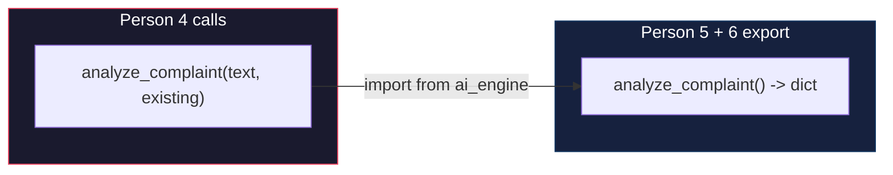

### Interface Contract

```
INPUT:
  complaint_text: str              # The new complaint's description
  existing_complaints: list[dict]  # [{"id": str, "description": str}, ...]

OUTPUT (dict):
  {
      "category":            str,     # Road | Water | Electricity | Garbage | Noise | Public Safety | Infrastructure | Other
      "sentiment":           str,     # Neutral | Negative | Critical
      "is_duplicate":        bool,    # True if similar complaint exists
      "duplicate_of":        str|None,# MongoDB _id of parent complaint, or None
      "similarity_score":    float,   # 0.0 to 1.0
      "priority_score":      float,   # 0.0 to 100.0
      "priority_level":      str,     # Low | Medium | High | Critical
      "recommended_action":  str,     # Human-readable action text
  }
```

### How to Work in Parallel

```mermaid
gantt
    title Backend Development Timeline
    dateFormat  X
    axisFormat %s

    section Person 4 (Core)
    database.py (Motor setup)        :a1, 0, 2
    models.py + schemas.py           :a2, 0, 2
    crud.py (async MongoDB ops)      :a3, after a2, 3
    main.py (all routes + CORS)      :a4, after a3, 2
    Testing                          :a5, after a4, 2

    section Person 5 (Category + Duplicate)
    ai_engine.py (skeleton)          :b1, 0, 1
    similarity.py                    :b2, 0, 3
    ai_engine.py (full orchestrator) :b3, after b2, 1
    Testing                          :b4, after b3, 2

    section Person 6 (Priority + Sentiment + Recommendation)
    sentiment_engine.py              :c1, 0, 2
    priority_engine.py               :c2, 0, 2
    recommendation_engine.py         :c3, 0, 2
    Testing                          :c4, after c3, 1

    section Merge
    Wire AI into POST /complaints    :merge1, after a4, 1
    Integration testing              :merge2, after merge1, 2
```

---

## 10. Sequence Diagrams

### 10.1 Complaint Submission Flow (Async)

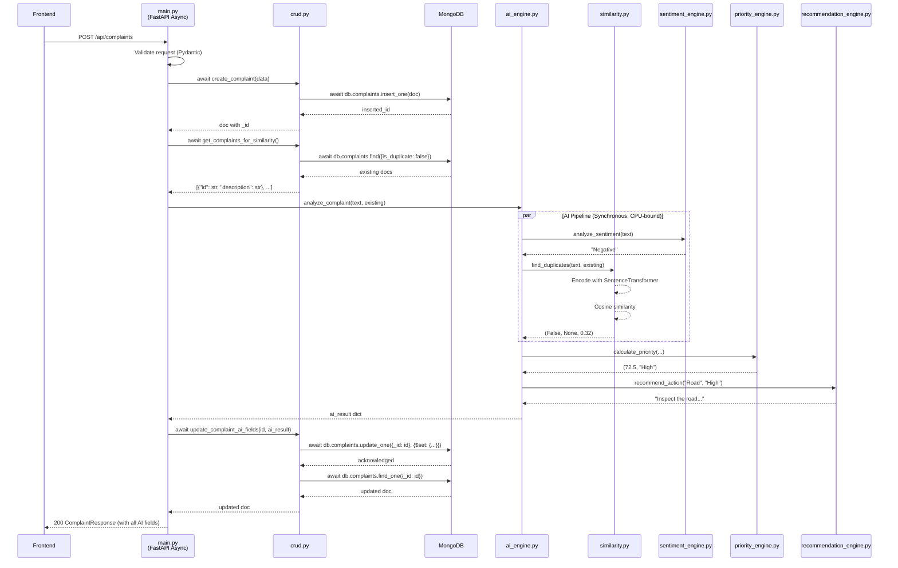

### 10.2 Dashboard Data Flow (Async Aggregation)

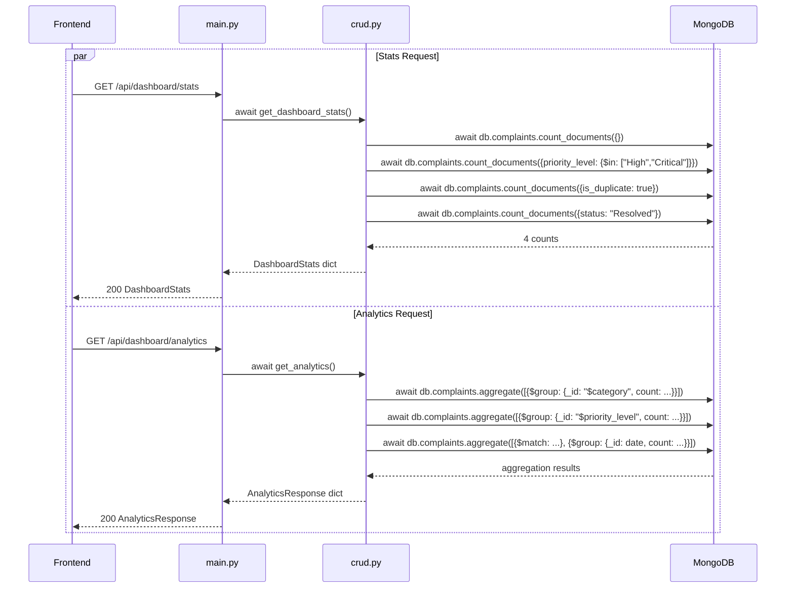

### 10.3 Duplicate Detection Deep Dive

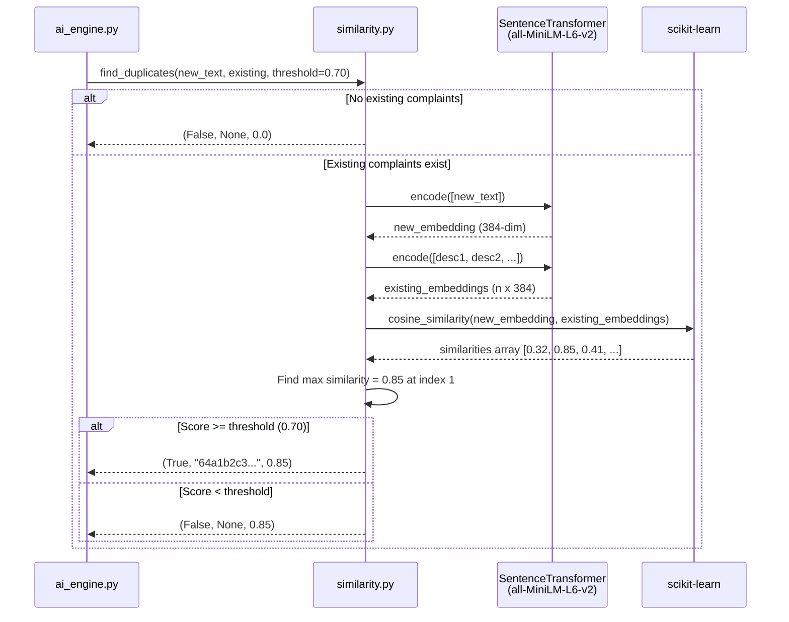

### 10.4 Complaint Status Update Flow

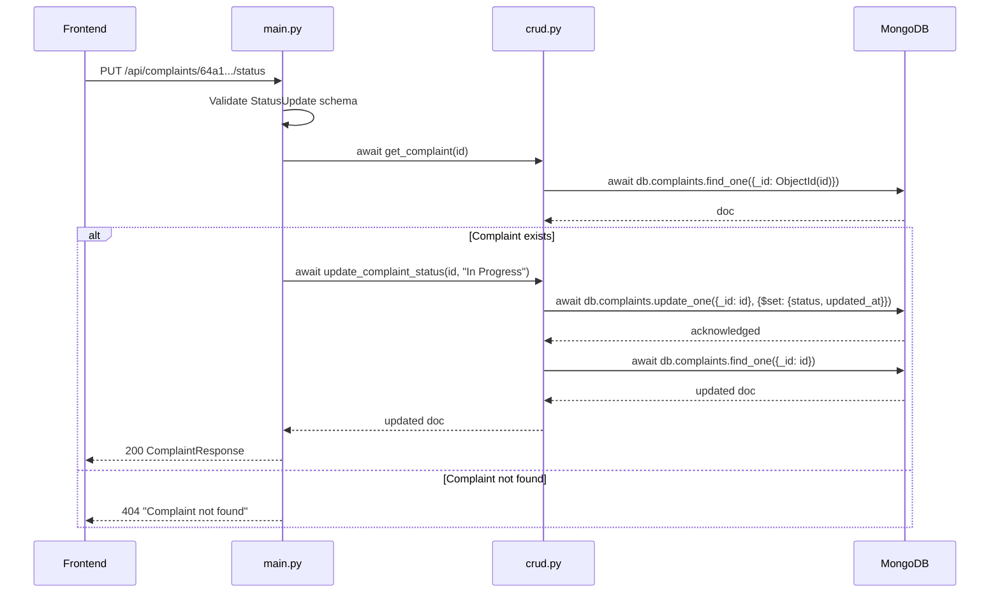

### 10.5 Map Complaints Flow

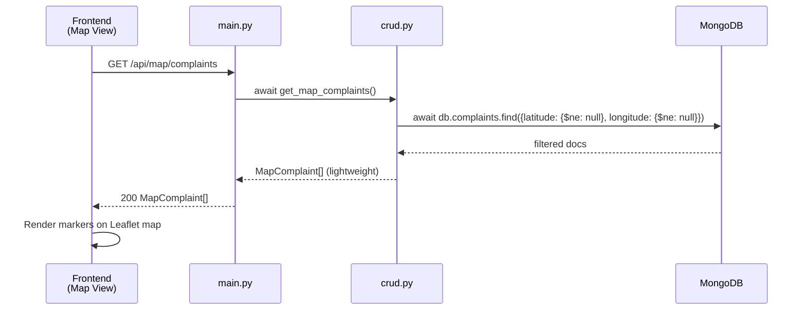

---

## 11. Workflow Diagrams

### 11.1 Overall Backend Build Process

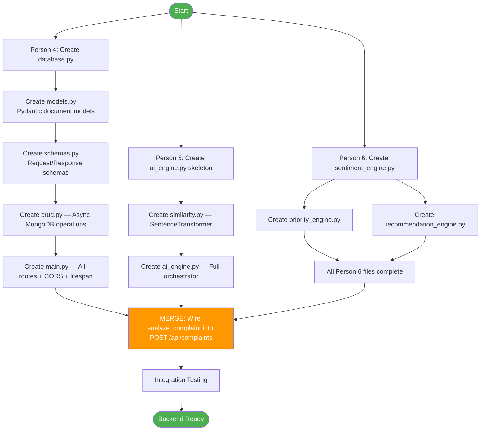

### 11.2 AI Analysis Decision Tree

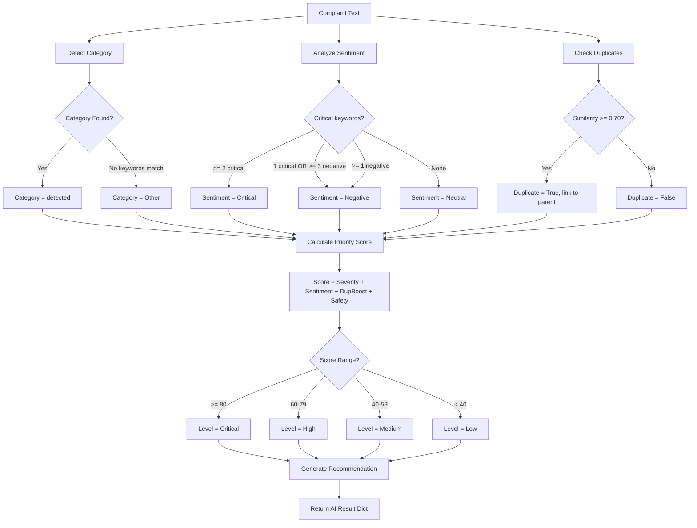

### 11.3 Request Handling Workflow

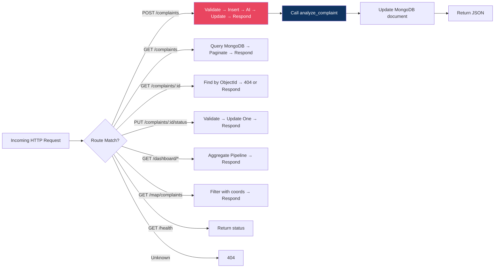

---

## 12. Integration with Other Teams

### 12.1 Team Dependency Map

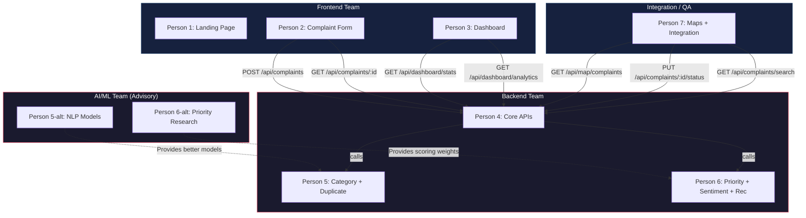

### 12.2 API Contracts for Frontend

| Frontend Component | Endpoint | Method | Notes |
|--------------------|----------|--------|-------|
| `ComplaintForm.jsx` | `/api/complaints` | `POST` | Send `ComplaintCreate`, receive full `ComplaintResponse` |
| `ComplaintResult.jsx` | `/api/complaints/:id` | `GET` | Display AI analysis results (id is a string now) |
| `Dashboard.jsx` | `/api/dashboard/stats` | `GET` | Card counts |
| `Dashboard.jsx` | `/api/dashboard/analytics` | `GET` | Chart data |
| `ComplaintMap.jsx` | `/api/map/complaints` | `GET` | Marker data with lat/lng |
| `Complaints.jsx` | `/api/complaints` | `GET` | List with `?skip=&limit=` pagination |
| `Complaints.jsx` | `/api/complaints/search` | `GET` | `?q=&category=&status=` filters |
| `ComplaintDetails.jsx` | `/api/complaints/:id` | `GET` | Full detail (id is a string) |
| `ComplaintDetails.jsx` | `/api/complaints/:id/status` | `PUT` | Status update |

### 12.3 AI/ML Team Handoff

If the AI/ML team improves models, they swap files Person 5 and Person 6 own:

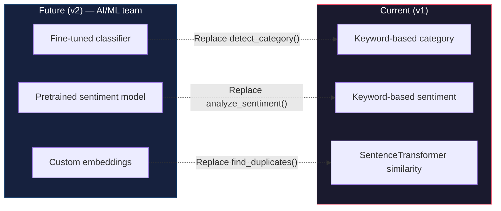

**Drop-in replacement contract:**

```python
# detect_category(text: str) -> str
# analyze_sentiment(text: str) -> str
# find_duplicates(new_text, existing, threshold) -> (bool, str|None, float)
#     ↑ Note: duplicate_of is now str (ObjectId), not int
```

---

## 13. Development Phases & Timeline

### Phase 1: Foundation (Day 1)

| Person 4 | Person 5 | Person 6 |
|----------|----------|----------|
| `database.py` — Motor client + indexes | `ai_engine.py` — skeleton with `detect_category()` | `sentiment_engine.py` — keyword-based |
| `models.py` — Pydantic document models | `similarity.py` — SentenceTransformer setup | `priority_engine.py` — scoring formula |
| `schemas.py` — All Pydantic schemas | | `recommendation_engine.py` — lookup table |

### Phase 2: API + AI (Day 2)

| Person 4 | Person 5 | Person 6 |
|----------|----------|----------|
| `crud.py` — All async MongoDB operations | `similarity.py` — Full duplicate detection | Test all AI functions standalone |
| `main.py` — All routes + CORS + lifespan | `ai_engine.py` — Full orchestrator | |

### Phase 3: Merge + Test (Day 3)

| All |
|-----|
| Wire `analyze_complaint()` into `POST /api/complaints` in `main.py` |
| Integration test: submit complaint → verify AI fields populated in MongoDB |
| Test all endpoints with `curl` / Swagger UI (`/docs`) |
| Fix CORS issues for frontend |

### Phase 4: Polish (Day 4)

| All |
|-----|
| Edge case handling (empty DB, invalid ObjectId, missing fields) |
| Error responses (proper HTTP status codes) |
| Seed sample complaints into MongoDB for frontend dev |
| Documentation at `/docs` (auto-generated by FastAPI) |

---

## 14. Testing Strategy

### 14.1 Manual Testing with Swagger

FastAPI auto-generates docs at `http://localhost:8000/docs`. Test all endpoints interactively.

### 14.2 Curl Tests

```bash
# Health check
curl http://localhost:8000/health

# Submit complaint
curl -X POST http://localhost:8000/api/complaints \
  -H "Content-Type: application/json" \
  -d '{
    "name": "Test User",
    "title": "Broken street light",
    "description": "The street light on 5th Avenue has been broken for 3 days. It is very dangerous at night.",
    "location_name": "5th Avenue, Sector 12",
    "latitude": 12.97,
    "longitude": 77.59
  }'

# Get all complaints
curl http://localhost:8000/api/complaints

# Get dashboard stats
curl http://localhost:8000/api/dashboard/stats

# Test AI standalone
curl -X POST http://localhost:8000/api/ai/analyze \
  -H "Content-Type: application/json" \
  -d '{"text": "There is a massive pothole near the hospital. Someone got injured yesterday."}'
```

### 14.3 Unit Test Skeleton (`test_ai_engine.py`)

```python
from ai_engine import analyze_complaint, detect_category


def test_detect_category_road():
    assert detect_category("There is a pothole on the road") == "Road"


def test_detect_category_water():
    assert detect_category("Water pipe is leaking badly") == "Water"


def test_analyze_complaint_returns_all_fields():
    result = analyze_complaint("Broken road near school", [])
    required_keys = {
        "category", "sentiment", "is_duplicate", "duplicate_of",
        "similarity_score", "priority_score", "priority_level", "recommended_action",
    }
    assert required_keys.issubset(result.keys())


def test_analyze_complaint_with_duplicates():
    existing = [
        {"id": "64a1b2c3d4e5f6a7b8c9d0e1", "description": "There is a pothole near the college"},
        {"id": "64a1b2c3d4e5f6a7b8c9d0e2", "description": "Water leakage in sector 5"},
    ]
    result = analyze_complaint("Road is badly damaged near the college gate", existing)
    assert result["is_duplicate"] is True
    assert result["duplicate_of"] == "64a1b2c3d4e5f6a7b8c9d0e1"
```

### 14.4 Unit Test Skeleton (`test_crud.py`)

```python
import pytest
from motor.motor_asyncio import AsyncIOMotorClient
from database import connect_db, get_db, close_db
from crud import create_complaint, get_complaint


@pytest.fixture(scope="module")
def event_loop():
    import asyncio
    loop = asyncio.new_event_loop()
    yield loop
    loop.close()


@pytest.fixture(scope="module")
async def setup_db():
    await connect_db()
    yield
    db = get_db()
    await db.complaints.drop()
    await close_db()


@pytest.mark.asyncio
async def test_create_and_get_complaint(setup_db):
    complaint_data = {
        "name": "Test",
        "title": "Test Title",
        "description": "Test Description",
        "location_name": "Test Location",
    }
    created = await create_complaint(complaint_data)
    assert created["_id"] is not None
    fetched = await get_complaint(str(created["_id"]))
    assert fetched["title"] == "Test Title"
```

---

## 15. Deployment & Runbook

### 15.1 Start MongoDB

```bash
# Local MongoDB (default port 27017)
mongod

# Or with Docker
docker run -d -p 27017:27017 --name civicmind-mongo mongo:7
```

### 15.2 Start the Backend

```bash
cd backend

# Install dependencies
pip install -r requirements.txt

# Run the server
uvicorn main:app --reload --host 0.0.0.0 --port 8000
```

### 15.3 Verify

- Swagger UI: `http://localhost:8000/docs`
- Health: `http://localhost:8000/health`
- MongoDB: database `civicmind`, collection `complaints` created automatically on first insert

### 15.4 Environment Variables

```env
MONGO_URI=mongodb://localhost:27017
DB_NAME=civicmind
CORS_ORIGINS=http://localhost:5173,http://localhost:3000
AI_MODEL_THRESHOLD=0.70
```

### 15.5 Common Issues

| Issue | Fix |
|-------|-----|
| `ModuleNotFoundError: ai_engine` | Ensure you're running from `backend/` directory |
| `ServerSelectionTimeoutError: MongoDB not running` | Start MongoDB: `mongod` or `docker start civicmind-mongo` |
| CORS errors from frontend | Check `allow_origins` in `main.py` matches frontend URL |
| `sentence-transformers` slow first load | Model downloads on first use (~80MB); subsequent loads use cache |
| `Invalid ObjectId` | Ensure frontend sends the 24-character hex string from MongoDB |
| Port already in use | `uvicorn main:app --port 8001` |
| `pymongo.errors.OperationFailure` | Check MongoDB auth, URI format, and network access |

---

## Quick Reference Card

```
Person 4: main.py, database.py, models.py, schemas.py, crud.py
Person 5: ai_engine.py, similarity.py
Person 6: priority_engine.py, sentiment_engine.py, recommendation_engine.py
Contract: analyze_complaint(text, existing) -> dict
Port:     8000
Docs:     http://localhost:8000/docs
DB:       MongoDB — civicmind.complaints
Mongo:    mongodb://localhost:27017
IDs:      ObjectId (24-char hex string)
```
