# CivicMind AI — Backend Implementation Guide

> **Team:** 2 Backend Developers (Person A & Person B)
> **Stack:** Python, FastAPI, SQLAlchemy, SQLite, Sentence Transformers, scikit-learn
> **Goal:** Build a production-ready backend for a civic complaint management system with AI-powered analysis

---

## Table of Contents

1. [System Architecture Overview](#1-system-architecture-overview)
2. [Project Structure](#2-project-structure)
3. [Tech Stack & Dependencies](#3-tech-stack--dependencies)
4. [Database Schema](#4-database-schema)
5. [Person A — Core Backend](#5-person-a--core-backend)
6. [Person B — AI/ML Engine Layer](#6-person-b--aiml-engine-layer)
7. [API Reference](#7-api-reference)
8. [Integration Contract](#8-integration-contract)
9. [Sequence Diagrams](#9-sequence-diagrams)
10. [Workflow Diagrams](#10-workflow-diagrams)
11. [Integration with Other Teams](#11-integration-with-other-teams)
12. [Development Phases & Timeline](#12-development-phases--timeline)
13. [Testing Strategy](#13-testing-strategy)
14. [Deployment & Runbook](#14-deployment--runbook)

---

## 1. System Architecture Overview

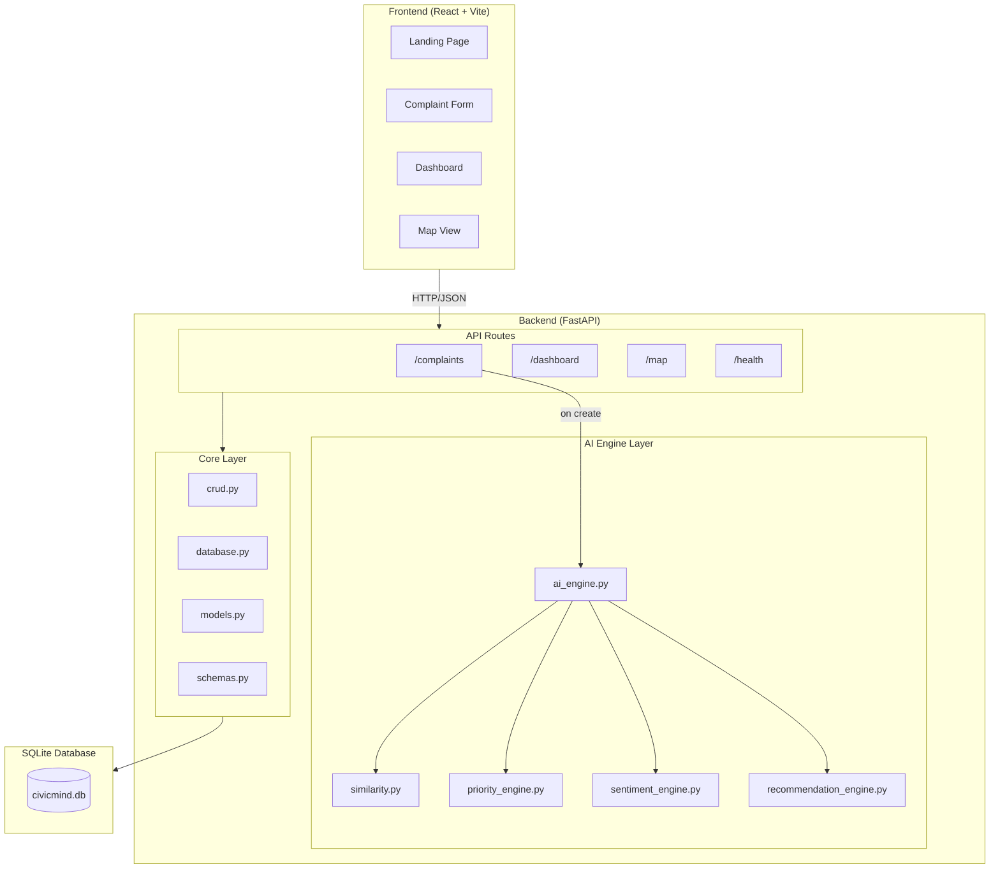

### High-Level Data Flow

```mermaid
flowchart LR
    A[Citizen Submits Complaint] --> B[Frontend validates form]
    B --> C[POST /api/complaints]
    C --> D[Person A: Validate & create DB record]
    D --> E[Person B: AI Analysis Pipeline]
    E --> F{Duplicate?}
    F -->|Yes| G[Flag as duplicate, link to parent]
    F -->|No| H[Continue]
    G --> I[Calculate Priority Score]
    H --> I
    I --> J[Generate Recommendation]
    J --> K[Save enriched record to DB]
    K --> L[Return full response to Frontend]
    L --> M[Show result to citizen]
    M --> N[Dashboard updates via GET /api/dashboard/*]
```

---

## 2. Project Structure

```
backend/
│
├── main.py                        # FastAPI app entry point, CORS, routers
├── database.py                    # SQLAlchemy engine, session, Base
├── models.py                      # ORM models (Complaint table)
├── schemas.py                     # Pydantic request/response schemas
├── crud.py                        # Database CRUD operations
├── requirements.txt               # Python dependencies
├── seed_data.py                   # Optional: seed DB with test data
│
├── routers/
│   ├── __init__.py
│   ├── complaints.py              # /complaints, /map/complaints endpoints
│   ├── dashboard.py               # /dashboard/stats, /dashboard/analytics
│   └── ai.py                      # /ai/analyze (standalone testing endpoint)
│
├── ai_engine.py                   # Orchestrator — calls all AI sub-modules
├── similarity.py                  # Duplicate detection (sentence-transformers)
├── priority_engine.py             # Priority scoring logic
├── sentiment_engine.py            # Sentiment analysis
├── recommendation_engine.py       # Action recommendation engine
│
├── tests/
│   ├── __init__.py
│   ├── test_crud.py
│   ├── test_complaints_api.py
│   ├── test_ai_engine.py
│   └── test_similarity.py
│
└── README.md
```

### Ownership Map

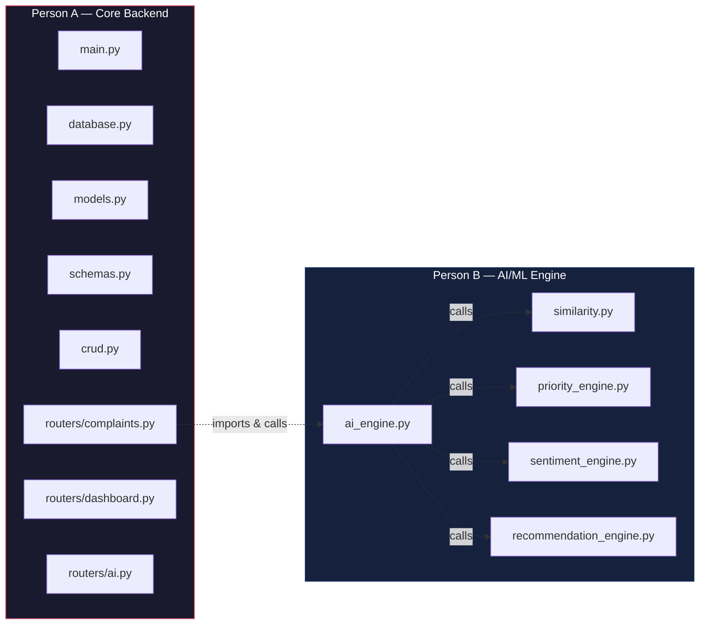

---

## 3. Tech Stack & Dependencies

### Person A Dependencies (`requirements.txt`)

```txt
fastapi==0.104.1
uvicorn[standard]==0.24.0
sqlalchemy==2.0.23
pydantic==2.5.2
python-multipart==0.0.6
```

### Person B Dependencies (`requirements.txt`)

```txt
sentence-transformers==2.2.2
scikit-learn==1.3.2
torch==2.1.0
numpy==1.26.2
```

### Installation

```bash
# Person A
pip install fastapi uvicorn sqlalchemy pydantic python-multipart

# Person B
pip install sentence-transformers scikit-learn torch numpy

# Or install everything at once
pip install -r requirements.txt
```

---

## 4. Database Schema

### Entity Relationship Diagram

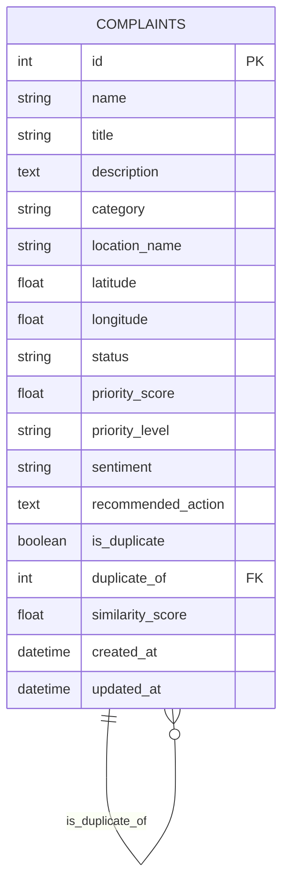

### Field Descriptions

| Field | Type | Default | Owner | Description |
|-------|------|---------|-------|-------------|
| `id` | Integer PK | auto | A | Auto-increment primary key |
| `name` | String | — | A | Citizen's name |
| `title` | String | — | A | Complaint title |
| `description` | Text | — | A | Full complaint text |
| `category` | String | `"Unknown"` | **B** | AI-detected category |
| `location_name` | String | — | A | Human-readable location |
| `latitude` | Float | `None` | A | Map coordinate |
| `longitude` | Float | `None` | A | Map coordinate |
| `status` | String | `"Pending"` | A | Pending / In Progress / Resolved |
| `priority_score` | Float | `0.0` | **B** | Calculated 0–100 score |
| `priority_level` | String | `"Low"` | **B** | Low / Medium / High / Critical |
| `sentiment` | String | `"Neutral"` | **B** | Neutral / Negative / Critical |
| `recommended_action` | Text | `""` | **B** | AI-generated action suggestion |
| `is_duplicate` | Boolean | `False` | **B** | Whether flagged as duplicate |
| `duplicate_of` | Integer FK | `None` | **B** | ID of parent complaint if duplicate |
| `similarity_score` | Float | `0.0` | **B** | Cosine similarity to parent |
| `created_at` | DateTime | `utcnow` | A | Creation timestamp |
| `updated_at` | DateTime | `utcnow` | A | Last update timestamp |

### Status Flow

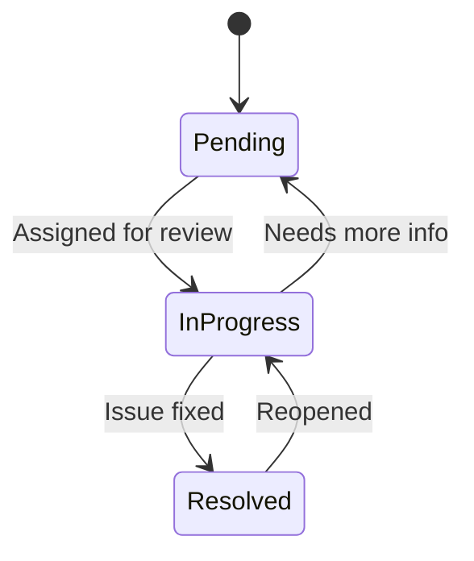

---

## 5. Person A — Core Backend

### 5.1 `database.py`

```python
from sqlalchemy import create_engine
from sqlalchemy.ext.declarative import declarative_base
from sqlalchemy.orm import sessionmaker

SQLALCHEMY_DATABASE_URL = "sqlite:///./civicmind.db"

engine = create_engine(
    SQLALCHEMY_DATABASE_URL, connect_args={"check_same_thread": False}
)
SessionLocal = sessionmaker(autocommit=False, autoflush=False, bind=engine)
Base = declarative_base()


def get_db():
    db = SessionLocal()
    try:
        yield db
    finally:
        db.close()
```

### 5.2 `models.py`

```python
from datetime import datetime
from sqlalchemy import Column, Integer, String, Text, Float, Boolean, DateTime, ForeignKey
from database import Base


class Complaint(Base):
    __tablename__ = "complaints"

    id = Column(Integer, primary_key=True, index=True)
    name = Column(String, nullable=False)
    title = Column(String, nullable=False)
    description = Column(Text, nullable=False)
    category = Column(String, default="Unknown")
    location_name = Column(String, nullable=False)
    latitude = Column(Float, nullable=True)
    longitude = Column(Float, nullable=True)
    status = Column(String, default="Pending")
    priority_score = Column(Float, default=0.0)
    priority_level = Column(String, default="Low")
    sentiment = Column(String, default="Neutral")
    recommended_action = Column(Text, default="")
    is_duplicate = Column(Boolean, default=False)
    duplicate_of = Column(Integer, ForeignKey("complaints.id"), nullable=True)
    similarity_score = Column(Float, default=0.0)
    created_at = Column(DateTime, default=datetime.utcnow)
    updated_at = Column(DateTime, default=datetime.utcnow, onupdate=datetime.utcnow)
```

### 5.3 `schemas.py`

```python
from datetime import datetime
from typing import Optional
from pydantic import BaseModel


class ComplaintCreate(BaseModel):
    name: str
    title: str
    description: str
    location_name: str
    latitude: Optional[float] = None
    longitude: Optional[float] = None


class StatusUpdate(BaseModel):
    status: str


class ComplaintResponse(BaseModel):
    id: int
    name: str
    title: str
    description: str
    category: str
    location_name: str
    latitude: Optional[float]
    longitude: Optional[float]
    status: str
    priority_score: float
    priority_level: str
    sentiment: str
    recommended_action: str
    is_duplicate: bool
    duplicate_of: Optional[int]
    similarity_score: float
    created_at: datetime
    updated_at: datetime

    class Config:
        from_attributes = True


class DashboardStats(BaseModel):
    total_complaints: int
    high_priority: int
    potential_duplicates: int
    resolved: int


class CategoryCount(BaseModel):
    category: str
    count: int


class PriorityCount(BaseModel):
    level: str
    count: int


class TrendPoint(BaseModel):
    date: str
    count: int


class AnalyticsResponse(BaseModel):
    category_distribution: list[CategoryCount]
    priority_distribution: list[PriorityCount]
    trend_data: list[TrendPoint]
```

### 5.4 `crud.py`

```python
from datetime import datetime, timedelta
from sqlalchemy.orm import Session
from sqlalchemy import func
from models import Complaint
from schemas import ComplaintCreate


def create_complaint(db: Session, complaint: ComplaintCreate) -> Complaint:
    db_complaint = Complaint(**complaint.model_dump())
    db.add(db_complaint)
    db.commit()
    db.refresh(db_complaint)
    return db_complaint


def get_complaint(db: Session, complaint_id: int) -> Complaint | None:
    return db.query(Complaint).filter(Complaint.id == complaint_id).first()


def get_all_complaints(db: Session, skip: int = 0, limit: int = 100) -> list[Complaint]:
    return db.query(Complaint).offset(skip).limit(limit).all()


def get_complaints_for_similarity(db: Session) -> list[dict]:
    """Returns lightweight data for AI duplicate detection."""
    rows = (
        db.query(Complaint.id, Complaint.description)
        .filter(Complaint.is_duplicate == False)
        .all()
    )
    return [{"id": r.id, "description": r.description} for r in rows]


def update_complaint_status(db: Session, complaint_id: int, status: str) -> Complaint | None:
    complaint = db.query(Complaint).filter(Complaint.id == complaint_id).first()
    if complaint:
        complaint.status = status
        complaint.updated_at = datetime.utcnow()
        db.commit()
        db.refresh(complaint)
    return complaint


def update_complaint_ai_fields(db: Session, complaint_id: int, ai_result: dict) -> Complaint | None:
    complaint = db.query(Complaint).filter(Complaint.id == complaint_id).first()
    if complaint:
        for key, value in ai_result.items():
            setattr(complaint, key, value)
        db.commit()
        db.refresh(complaint)
    return complaint


def get_dashboard_stats(db: Session) -> dict:
    total = db.query(Complaint).count()
    high_priority = db.query(Complaint).filter(
        Complaint.priority_level.in_(["High", "Critical"])
    ).count()
    duplicates = db.query(Complaint).filter(Complaint.is_duplicate == True).count()
    resolved = db.query(Complaint).filter(Complaint.status == "Resolved").count()
    return {
        "total_complaints": total,
        "high_priority": high_priority,
        "potential_duplicates": duplicates,
        "resolved": resolved,
    }


def get_analytics(db: Session) -> dict:
    category_dist = (
        db.query(Complaint.category, func.count(Complaint.id))
        .group_by(Complaint.category)
        .all()
    )
    priority_dist = (
        db.query(Complaint.priority_level, func.count(Complaint.id))
        .group_by(Complaint.priority_level)
        .all()
    )
    thirty_days_ago = datetime.utcnow() - timedelta(days=30)
    trend = (
        db.query(
            func.date(Complaint.created_at).label("date"),
            func.count(Complaint.id),
        )
        .filter(Complaint.created_at >= thirty_days_ago)
        .group_by(func.date(Complaint.created_at))
        .all()
    )
    return {
        "category_distribution": [{"category": c, "count": n} for c, n in category_dist],
        "priority_distribution": [{"level": p, "count": n} for p, n in priority_dist],
        "trend_data": [{"date": str(d), "count": n} for d, n in trend],
    }


def search_complaints(
    db: Session, query: str = "", category: str = "", status: str = ""
) -> list[Complaint]:
    q = db.query(Complaint)
    if query:
        q = q.filter(
            Complaint.title.contains(query) | Complaint.description.contains(query)
        )
    if category:
        q = q.filter(Complaint.category == category)
    if status:
        q = q.filter(Complaint.status == status)
    return q.all()


def get_map_complaints(db: Session) -> list[dict]:
    return [
        {
            "id": c.id,
            "title": c.title,
            "category": c.category,
            "priority_level": c.priority_level,
            "status": c.status,
            "latitude": c.latitude,
            "longitude": c.longitude,
            "location_name": c.location_name,
        }
        for c in db.query(Complaint)
        .filter(Complaint.latitude.isnot(None), Complaint.longitude.isnot(None))
        .all()
    ]
```

### 5.5 `routers/complaints.py`

```python
from fastapi import APIRouter, Depends, HTTPException, Query
from sqlalchemy.orm import Session
from database import get_db
from schemas import ComplaintCreate, ComplaintResponse, StatusUpdate
from crud import (
    create_complaint, get_complaint, get_all_complaints,
    update_complaint_status, update_complaint_ai_fields,
    get_complaints_for_similarity, search_complaints, get_map_complaints,
)
from ai_engine import analyze_complaint

router = APIRouter()


@router.post("/complaints", response_model=ComplaintResponse)
def submit_complaint(complaint: ComplaintCreate, db: Session = Depends(get_db)):
    # 1. Save complaint to get an ID
    db_complaint = create_complaint(db, complaint)

    # 2. Get existing complaints for duplicate detection
    existing = get_complaints_for_similarity(db)

    # 3. Run AI analysis
    ai_result = analyze_complaint(complaint.description, existing)

    # 4. Update the complaint with AI results
    db_complaint = update_complaint_ai_fields(db, db_complaint.id, ai_result)

    return db_complaint


@router.get("/complaints", response_model=list[ComplaintResponse])
def list_complaints(
    skip: int = Query(0, ge=0),
    limit: int = Query(100, ge=1, le=500),
    db: Session = Depends(get_db),
):
    return get_all_complaints(db, skip=skip, limit=limit)


@router.get("/complaints/{complaint_id}", response_model=ComplaintResponse)
def get_single_complaint(complaint_id: int, db: Session = Depends(get_db)):
    complaint = get_complaint(db, complaint_id)
    if not complaint:
        raise HTTPException(status_code=404, detail="Complaint not found")
    return complaint


@router.put("/complaints/{complaint_id}/status", response_model=ComplaintResponse)
def update_status(complaint_id: int, update: StatusUpdate, db: Session = Depends(get_db)):
    complaint = update_complaint_status(db, complaint_id, update.status)
    if not complaint:
        raise HTTPException(status_code=404, detail="Complaint not found")
    return complaint


@router.get("/complaints/search", response_model=list[ComplaintResponse])
def search(
    q: str = Query("", description="Search in title and description"),
    category: str = Query("", description="Filter by category"),
    status: str = Query("", description="Filter by status"),
    db: Session = Depends(get_db),
):
    return search_complaints(db, query=q, category=category, status=status)


@router.get("/map/complaints")
def map_complaints(db: Session = Depends(get_db)):
    return get_map_complaints(db)
```

### 5.6 `routers/dashboard.py`

```python
from fastapi import APIRouter, Depends
from sqlalchemy.orm import Session
from database import get_db
from schemas import DashboardStats, AnalyticsResponse
from crud import get_dashboard_stats, get_analytics

router = APIRouter()


@router.get("/dashboard/stats", response_model=DashboardStats)
def stats(db: Session = Depends(get_db)):
    return get_dashboard_stats(db)


@router.get("/dashboard/analytics", response_model=AnalyticsResponse)
def analytics(db: Session = Depends(get_db)):
    return get_analytics(db)
```

### 5.7 `main.py`

```python
from fastapi import FastAPI
from fastapi.middleware.cors import CORSMiddleware
from database import engine, Base
from routers import complaints, dashboard

Base.metadata.create_all(bind=engine)

app = FastAPI(
    title="CivicMind AI",
    description="AI-powered civic complaint management system",
    version="1.0.0",
)

app.add_middleware(
    CORSMiddleware,
    allow_origins=["http://localhost:5173", "http://localhost:3000"],
    allow_credentials=True,
    allow_methods=["*"],
    allow_headers=["*"],
)

app.include_router(complaints.router, prefix="/api", tags=["Complaints"])
app.include_router(dashboard.router, prefix="/api", tags=["Dashboard"])


@app.get("/health")
def health_check():
    return {"status": "healthy", "service": "CivicMind AI"}


@app.get("/")
def root():
    return {"message": "CivicMind AI Backend", "docs": "/docs"}
```

---

## 6. Person B — AI/ML Engine Layer

### 6.1 `ai_engine.py` — Orchestrator

This is the **single entry point** that Person A calls.

```python
from similarity import find_duplicates
from sentiment_engine import analyze_sentiment
from priority_engine import calculate_priority
from recommendation_engine import recommend_action

# Category detection keywords
CATEGORY_KEYWORDS = {
    "Road": ["pothole", "road", "street", "pavement", "traffic", "signal", "speed breaker", "asphalt"],
    "Water": ["water", "leak", "pipe", "drainage", "flood", "sewage", "tap", "borewell"],
    "Electricity": ["power", "electric", "light", "wire", "outage", "transformer", "current", "bulb"],
    "Garbage": ["garbage", "waste", "trash", "dump", "clean", "bin", "overflow", "litter"],
    "Noise": ["noise", "loud", "sound", "music", "construction", "honking", "factory"],
    "Public Safety": ["danger", "unsafe", "crime", "assault", "theft", "attack", "goons", "drug"],
    "Infrastructure": ["building", "bridge", "collapse", "crack", "wall", "structure", "demolition"],
}


def detect_category(text: str) -> str:
    text_lower = text.lower()
    scores = {}
    for category, keywords in CATEGORY_KEYWORDS.items():
        score = sum(1 for kw in keywords if kw in text_lower)
        if score > 0:
            scores[category] = score
    if scores:
        return max(scores, key=scores.get)
    return "Other"


def analyze_complaint(complaint_text: str, existing_complaints: list[dict]) -> dict:
    """
    Main AI pipeline. Called by Person A after complaint creation.

    Args:
        complaint_text: The description of the new complaint
        existing_complaints: List of dicts with 'id' and 'description' keys

    Returns:
        dict with keys: category, sentiment, is_duplicate, duplicate_of,
                        similarity_score, priority_score, priority_level,
                        recommended_action
    """
    category = detect_category(complaint_text)
    sentiment = analyze_sentiment(complaint_text)
    is_dup, dup_id, sim_score = find_duplicates(complaint_text, existing_complaints)
    priority_score, priority_level = calculate_priority(
        category=category,
        sentiment=sentiment,
        is_duplicate=is_dup,
        similarity_score=sim_score,
        text=complaint_text,
    )
    action = recommend_action(category, priority_level)

    return {
        "category": category,
        "sentiment": sentiment,
        "is_duplicate": is_dup,
        "duplicate_of": dup_id,
        "similarity_score": round(sim_score, 4),
        "priority_score": round(priority_score, 2),
        "priority_level": priority_level,
        "recommended_action": action,
    }
```

### 6.2 `similarity.py` — Duplicate Detection

```python
from sentence_transformers import SentenceTransformer
from sklearn.metrics.pairwise import cosine_similarity
import numpy as np

# Load model once at module level
model = SentenceTransformer("all-MiniLM-L6-v2")


def find_duplicates(
    new_text: str,
    existing_complaints: list[dict],
    threshold: float = 0.70,
) -> tuple[bool, int | None, float]:
    """
    Detect if a new complaint is a duplicate of an existing one.

    Args:
        new_text: Description of the new complaint
        existing_complaints: List of {"id": int, "description": str}
        threshold: Similarity threshold (0-1) to consider a duplicate

    Returns:
        (is_duplicate, duplicate_of_id, similarity_score)
    """
    if not existing_complaints:
        return False, None, 0.0

    new_embedding = model.encode([new_text])
    existing_texts = [c["description"] for c in existing_complaints]
    existing_embeddings = model.encode(existing_texts)

    similarities = cosine_similarity(new_embedding, existing_embeddings)[0]

    max_idx = int(np.argmax(similarities))
    max_score = float(similarities[max_idx])

    if max_score >= threshold:
        return True, existing_complaints[max_idx]["id"], max_score

    return False, None, max_score
```

### 6.3 `sentiment_engine.py`

```python
CRITICAL_KEYWORDS = [
    "death", "died", "killed", "injury", "injured", "accident", "dangerous",
    "fatal", "hospital", "bleeding", "unconscious",
]

NEGATIVE_KEYWORDS = [
    "broken", "bad", "terrible", "worst", "horrible", "ugly", "disgusting",
    "annoying", "frustrated", "angry", "furious", "disappointed", "pathetic",
    "damaged", "ruined", "filthy", "stinking", "overflowing",
]


def analyze_sentiment(text: str) -> str:
    """
    Simple keyword-based sentiment analysis.

    Returns: "Critical" | "Negative" | "Neutral"
    """
    text_lower = text.lower()

    critical_count = sum(1 for kw in CRITICAL_KEYWORDS if kw in text_lower)
    negative_count = sum(1 for kw in NEGATIVE_KEYWORDS if kw in text_lower)

    if critical_count >= 2:
        return "Critical"
    if critical_count >= 1 or negative_count >= 3:
        return "Negative"
    if negative_count >= 1:
        return "Negative"
    return "Neutral"
```

### 6.4 `priority_engine.py`

```python
SAFETY_CATEGORIES = {"Road", "Public Safety", "Infrastructure"}

CATEGORY_BASE_SEVERITY = {
    "Road": 20,
    "Water": 18,
    "Electricity": 16,
    "Garbage": 10,
    "Noise": 8,
    "Public Safety": 25,
    "Infrastructure": 22,
    "Other": 10,
}


def calculate_priority(
    category: str,
    sentiment: str,
    is_duplicate: bool,
    similarity_score: float,
    text: str,
) -> tuple[float, str]:
    """
    Calculate priority score (0-100) and level.

    Components:
        - Severity from category:      0-30 points
        - Sentiment weight:            0-25 points
        - Duplicate frequency boost:   0-20 points
        - Safety risk factor:          0-25 points

    Returns:
        (score, level)
    """
    # 1. Base severity from category (0-30)
    severity = min(CATEGORY_BASE_SEVERITY.get(category, 10), 30)

    # 2. Sentiment score (0-25)
    sentiment_scores = {"Neutral": 5, "Negative": 15, "Critical": 25}
    sentiment_score = sentiment_scores.get(sentiment, 5)

    # 3. Duplicate boost (0-20)
    dup_boost = 0
    if is_duplicate:
        dup_boost = min(10 + (similarity_score * 10), 20)

    # 4. Safety risk (0-25)
    safety_score = 0
    if category in SAFETY_CATEGORIES:
        safety_score = 15
    if sentiment == "Critical":
        safety_score = min(safety_score + 10, 25)

    total = severity + sentiment_score + dup_boost + safety_score
    total = min(max(total, 0), 100)

    if total >= 80:
        level = "Critical"
    elif total >= 60:
        level = "High"
    elif total >= 40:
        level = "Medium"
    else:
        level = "Low"

    return total, level
```

### 6.5 `recommendation_engine.py`

```python
RECOMMENDATIONS = {
    # (category, priority_level) -> action text
    ("Road", "Critical"): "Deploy emergency road repair team immediately. Place warning barricades and redirect traffic. Schedule urgent inspection within 2 hours.",
    ("Road", "High"): "Inspect the road within 24 hours. Place temporary warning signs and schedule repair within a week.",
    ("Road", "Medium"): "Schedule road inspection within 48 hours. Plan repair in the next maintenance cycle.",
    ("Road", "Low"): "Add to regular road maintenance schedule. Monitor for escalation.",

    ("Water", "Critical"): "Deploy emergency water management team immediately. Check for pipe burst or flooding. Coordinate with municipal water board.",
    ("Water", "High"): "Inspect water infrastructure within 24 hours. Arrange water supply alternatives if needed.",
    ("Water", "Medium"): "Schedule water system inspection within 48 hours. Check for leaks and pipe damage.",
    ("Water", "Low"): "Add to routine water infrastructure maintenance schedule.",

    ("Electricity", "Critical"): "Report to power utility immediately. Deploy safety team to secure the area. Risk of electrocution — cordon off the zone.",
    ("Electricity", "High"): "Notify electricity board within 4 hours. Arrange temporary power if needed.",
    ("Electricity", "Medium"): "Schedule electrical inspection within 48 hours.",
    ("Electricity", "Low"): "Log for routine electrical maintenance.",

    ("Garbage", "Critical"): "Deploy emergency cleanup crew. Health hazard — notify sanitation department immediately.",
    ("Garbage", "High"): "Arrange garbage collection within 24 hours. Check for health hazards.",
    ("Garbage", "Medium"): "Schedule waste collection within 48 hours.",
    ("Garbage", "Low"): "Add to regular waste collection route.",

    ("Noise", "High"): "Investigate noise source within 24 hours. Issue warning if violating regulations.",
    ("Noise", "Medium"): "Schedule noise level monitoring. Issue notice to offending party.",
    ("Noise", "Low"): "Log for periodic monitoring.",

    ("Public Safety", "Critical"): "Immediate police/security response. Cordon the area. Notify emergency services.",
    ("Public Safety", "High"): "Deploy security patrol within 2 hours. Increase surveillance in the area.",
    ("Public Safety", "Medium"): "Schedule security review within 24 hours.",
    ("Public Safety", "Low"): "Add to regular safety patrol route.",

    ("Infrastructure", "Critical"): "Emergency structural assessment. Evacuate if needed. Deploy engineering team immediately.",
    ("Infrastructure", "High"): "Structural inspection within 24 hours. Restrict access to affected area.",
    ("Infrastructure", "Medium"): "Schedule engineering assessment within 48 hours.",
    ("Infrastructure", "Low"): "Add to infrastructure maintenance schedule.",
}

DEFAULT_RECOMMENDATIONS = {
    "Critical": "Urgent attention required. Assign to senior officer for immediate review and action.",
    "High": "Priority case. Assign review officer and schedule assessment within 24 hours.",
    "Medium": "Schedule review within 48 hours. Assign to appropriate department.",
    "Low": "Standard processing. Add to regular review queue.",
}


def recommend_action(category: str, priority_level: str) -> str:
    key = (category, priority_level)
    if key in RECOMMENDATIONS:
        return RECOMMENDATIONS[key]
    return DEFAULT_RECOMMENDATIONS.get(priority_level, "Review and take appropriate action.")
```

### 6.6 `routers/ai.py` — Standalone Testing Endpoint

```python
from fastapi import APIRouter
from pydantic import BaseModel
from ai_engine import analyze_complaint

router = APIRouter()


class AnalyzeRequest(BaseModel):
    text: str


@router.post("/ai/analyze")
def analyze(request: AnalyzeRequest):
    """Standalone endpoint for testing AI pipeline without DB."""
    result = analyze_complaint(request.text, existing_complaints=[])
    return result
```

---

## 7. API Reference

### Endpoints Summary

| Method | Endpoint | Description | Request Body | Response |
|--------|----------|-------------|--------------|----------|
| `GET` | `/health` | Health check | — | `{status, service}` |
| `POST` | `/api/complaints` | Submit complaint | `ComplaintCreate` | `ComplaintResponse` |
| `GET` | `/api/complaints` | List all complaints | query: `skip`, `limit` | `ComplaintResponse[]` |
| `GET` | `/api/complaints/{id}` | Get single complaint | — | `ComplaintResponse` |
| `PUT` | `/api/complaints/{id}/status` | Update status | `StatusUpdate` | `ComplaintResponse` |
| `GET` | `/api/complaints/search` | Search/filter | query: `q`, `category`, `status` | `ComplaintResponse[]` |
| `GET` | `/api/map/complaints` | Map data | — | `MapComplaint[]` |
| `GET` | `/api/dashboard/stats` | Dashboard stats | — | `DashboardStats` |
| `GET` | `/api/dashboard/analytics` | Charts data | — | `AnalyticsResponse` |
| `POST` | `/api/ai/analyze` | Test AI pipeline | `{text}` | `AIResult` |

### Request/Response Examples

**POST /api/complaints**
```json
// Request
{
    "name": "Ravi Kumar",
    "title": "Large pothole on MG Road",
    "description": "There is a dangerous pothole near the college gate on MG Road. Multiple bikes have fallen here.",
    "location_name": "MG Road, near City College",
    "latitude": 12.9716,
    "longitude": 77.5946
}

// Response
{
    "id": 1,
    "name": "Ravi Kumar",
    "title": "Large pothole on MG Road",
    "description": "There is a dangerous pothole near the college gate on MG Road. Multiple bikes have fallen here.",
    "category": "Road",
    "location_name": "MG Road, near City College",
    "latitude": 12.9716,
    "longitude": 77.5946,
    "status": "Pending",
    "priority_score": 72.5,
    "priority_level": "High",
    "sentiment": "Negative",
    "recommended_action": "Inspect the road within 24 hours. Place temporary warning signs and schedule repair within a week.",
    "is_duplicate": false,
    "duplicate_of": null,
    "similarity_score": 0.32,
    "created_at": "2026-08-20T10:30:00",
    "updated_at": "2026-08-20T10:30:00"
}
```

**GET /api/dashboard/stats**
```json
{
    "total_complaints": 156,
    "high_priority": 34,
    "potential_duplicates": 12,
    "resolved": 89
}
```

**GET /api/dashboard/analytics**
```json
{
    "category_distribution": [
        {"category": "Road", "count": 45},
        {"category": "Water", "count": 32},
        {"category": "Garbage", "count": 28}
    ],
    "priority_distribution": [
        {"level": "Critical", "count": 5},
        {"level": "High", "count": 29},
        {"level": "Medium", "count": 60},
        {"level": "Low", "count": 62}
    ],
    "trend_data": [
        {"date": "2026-08-01", "count": 8},
        {"date": "2026-08-02", "count": 12}
    ]
}
```

---

## 8. Integration Contract

The **only coupling point** between Person A and Person B is the `analyze_complaint()` function signature and its return dictionary.

### Agreement

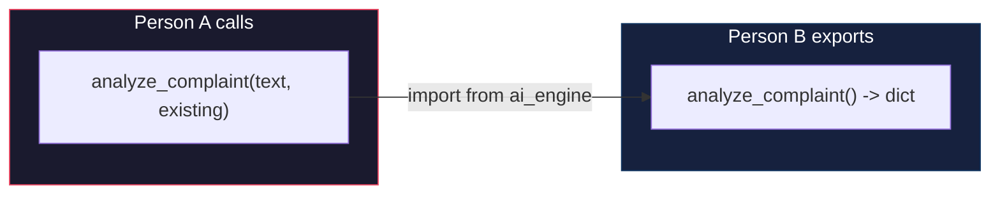

### Interface Contract

```
INPUT:
  complaint_text: str          # The new complaint's description
  existing_complaints: list[dict]  # [{"id": int, "description": str}, ...]

OUTPUT (dict):
  {
      "category":            str,     # One of: Road, Water, Electricity, Garbage, Noise, Public Safety, Infrastructure, Other
      "sentiment":           str,     # One of: Neutral, Negative, Critical
      "is_duplicate":        bool,    # True if similar complaint exists
      "duplicate_of":        int|None,# ID of parent complaint, or None
      "similarity_score":    float,   # 0.0 to 1.0
      "priority_score":      float,   # 0.0 to 100.0
      "priority_level":      str,     # One of: Low, Medium, High, Critical
      "recommended_action":  str,     # Human-readable action text
  }
```

### How to work in parallel

```mermaid
gantt
    title Backend Development Timeline
    dateFormat  X
    axisFormat %s

    section Person A (Core)
    database.py + models.py     :a1, 0, 3
    schemas.py + crud.py        :a2, after a1, 3
    routers/complaints.py       :a3, after a2, 2
    routers/dashboard.py        :a4, after a2, 1
    main.py + CORS              :a5, after a3, 1
    Testing                     :a6, after a5, 2

    section Person B (AI)
    ai_engine.py (skeleton)     :b1, 0, 1
    sentiment_engine.py         :b2, 0, 2
    priority_engine.py          :b3, 0, 2
    recommendation_engine.py    :b4, 0, 2
    similarity.py               :b5, 0, 3
    ai_engine.py (full)         :b6, after b5, 1
    Testing                     :b7, after b6, 2

    section Merge
    Wire AI into POST /complaints :merge1, after a5, 1
    Integration testing           :merge2, after merge1, 2
```

---

## 9. Sequence Diagrams

### 9.1 Complaint Submission Flow

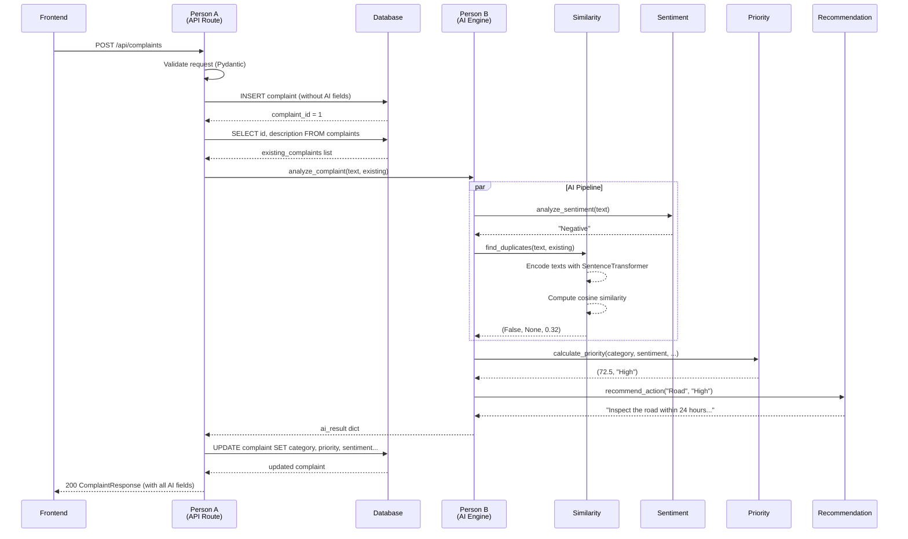

### 9.2 Dashboard Data Flow

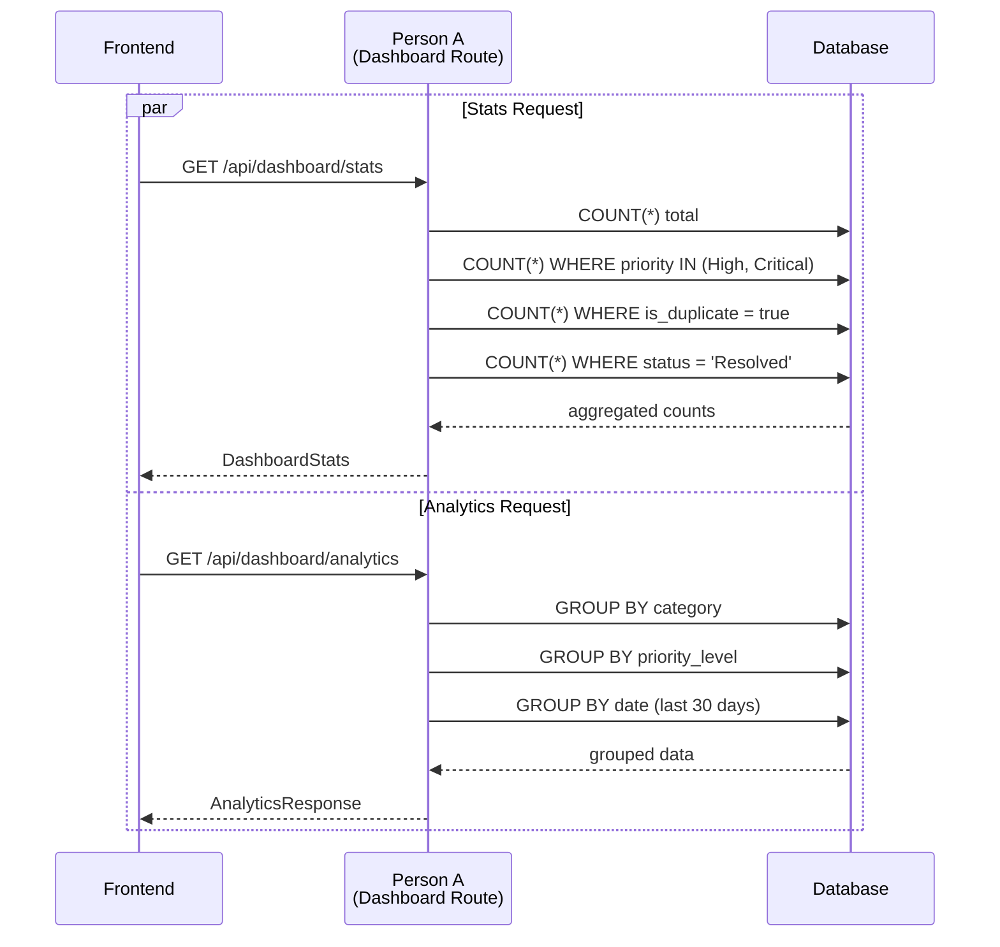

### 9.3 Duplicate Detection Deep Dive

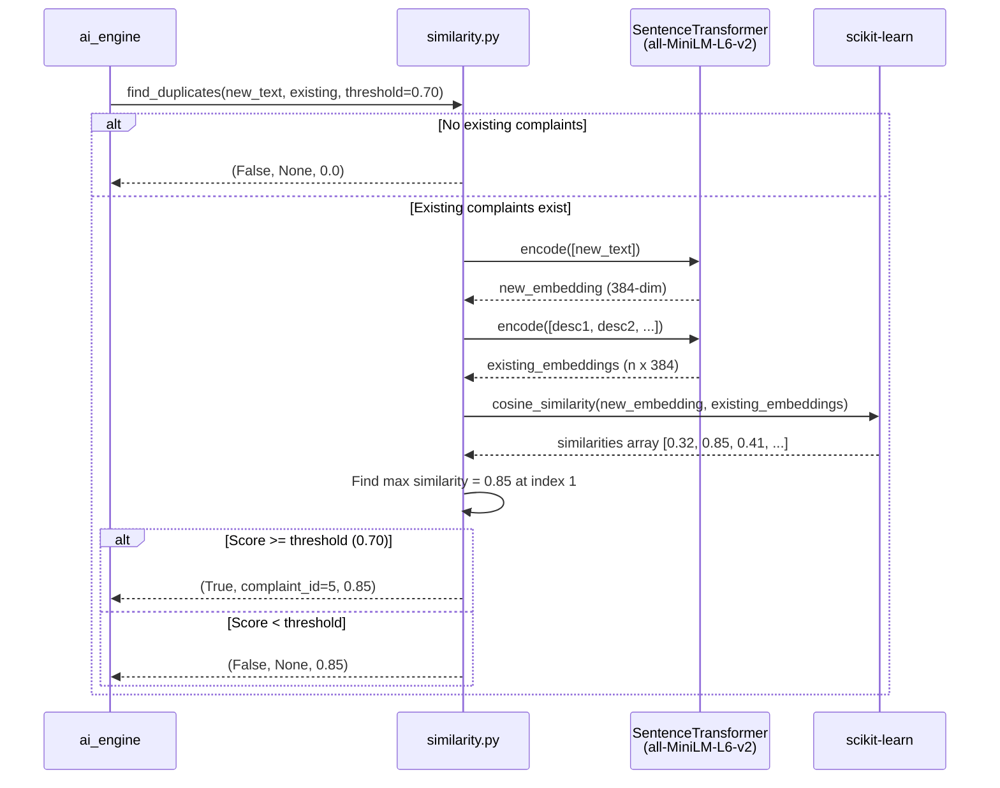

### 9.4 Complaint Status Update Flow

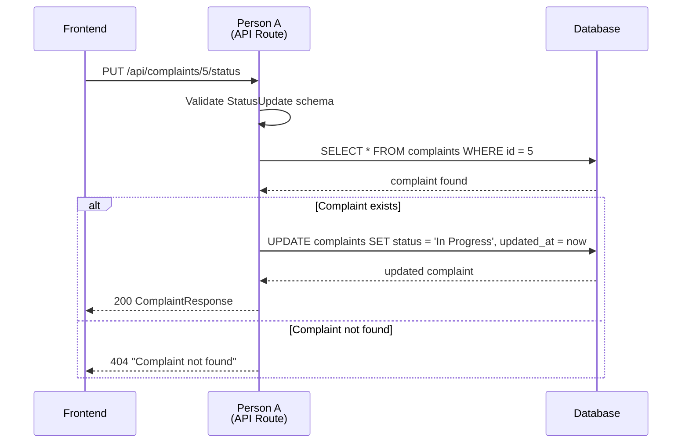

### 9.5 Map Complaints Flow

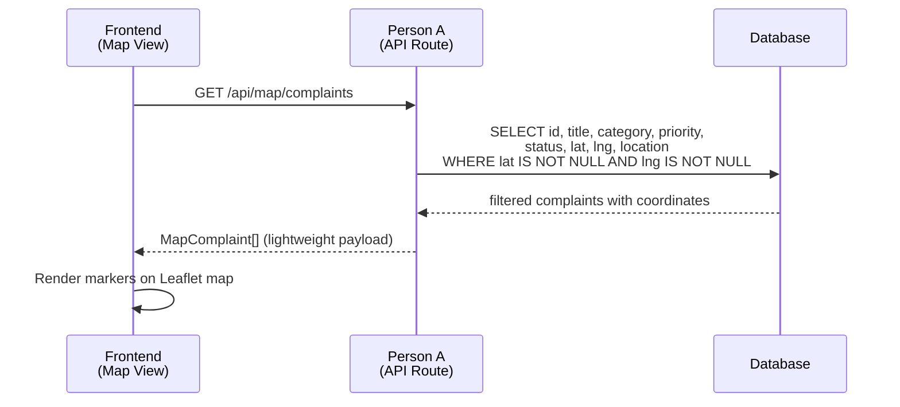

---

## 10. Workflow Diagrams

### 10.1 Overall Backend Build Process

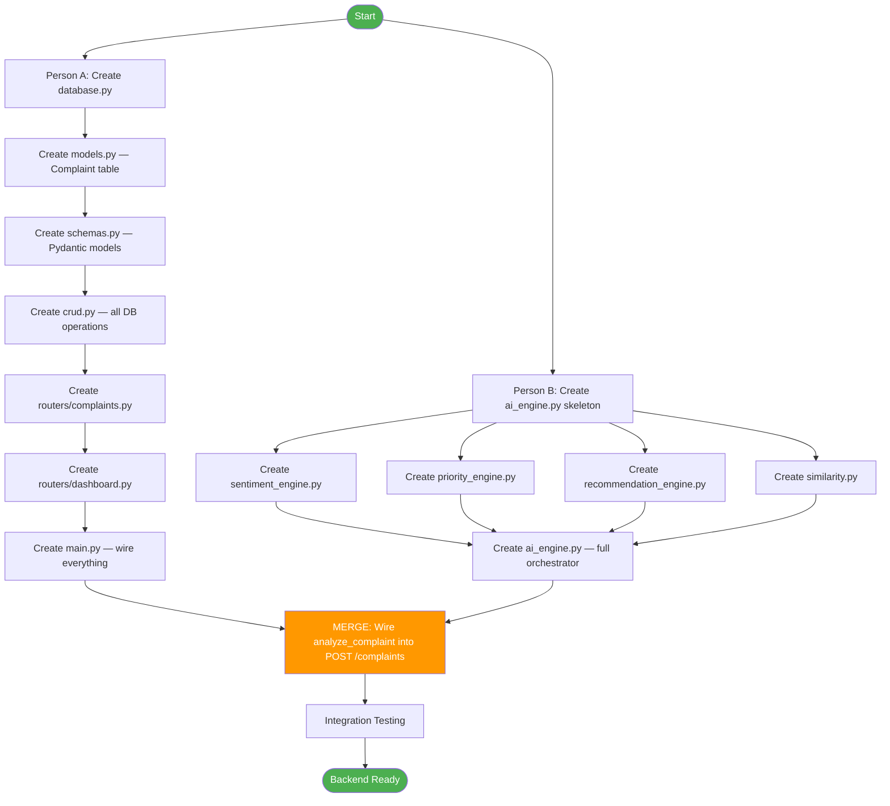

### 10.2 AI Analysis Decision Tree

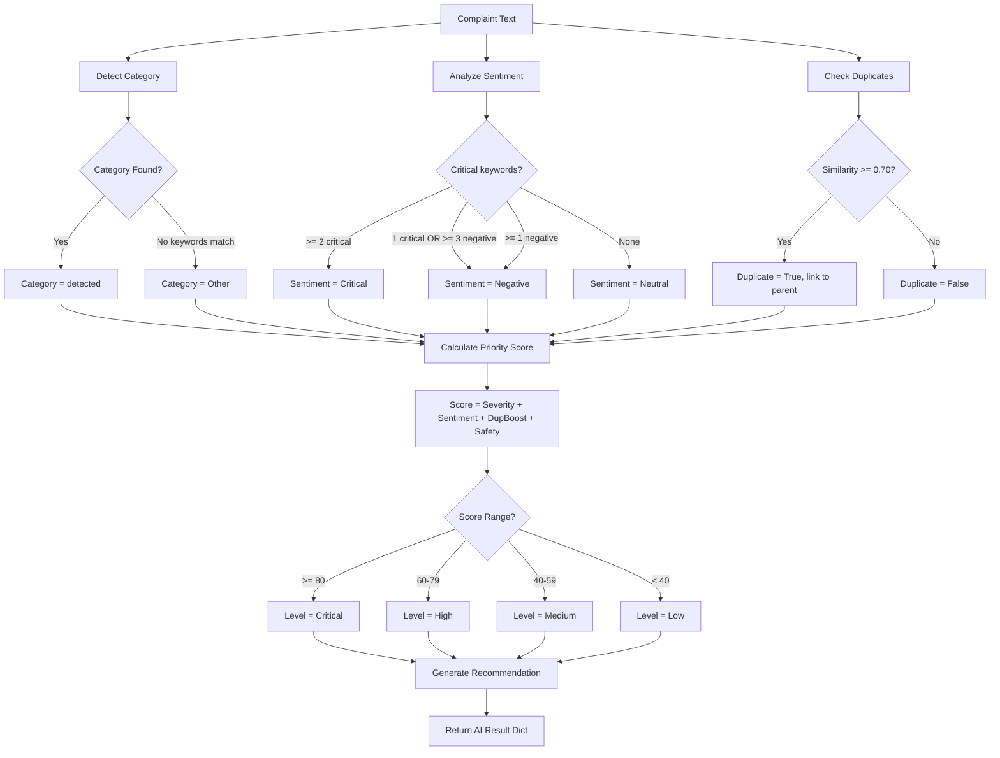

### 10.3 Request Handling Workflow

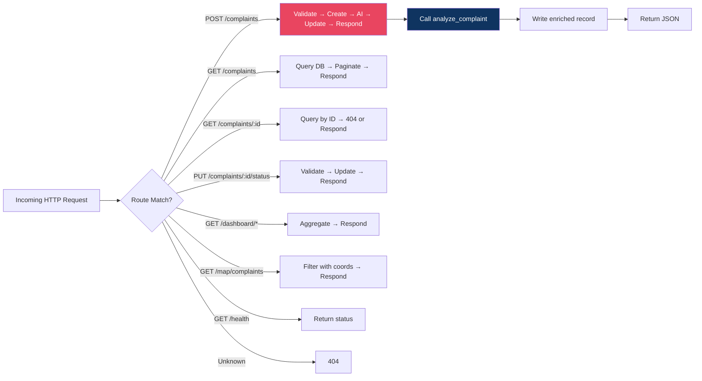

---

## 11. Integration with Other Teams

### 11.1 Team Dependency Map

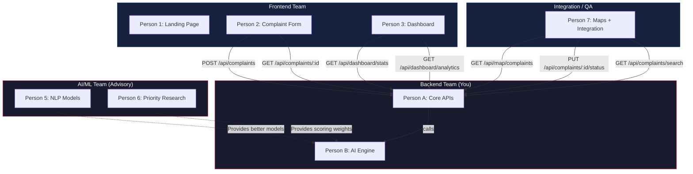

### 11.2 API Contracts for Frontend

Frontend team needs these exact endpoints and payloads:

| Frontend Component | Endpoint | Method | Notes |
|--------------------|----------|--------|-------|
| `ComplaintForm.jsx` | `/api/complaints` | `POST` | Send `ComplaintCreate`, receive full `ComplaintResponse` |
| `ComplaintResult.jsx` | `/api/complaints/:id` | `GET` | Display AI analysis results |
| `Dashboard.jsx` | `/api/dashboard/stats` | `GET` | Card counts |
| `Dashboard.jsx` | `/api/dashboard/analytics` | `GET` | Chart data |
| `ComplaintMap.jsx` | `/api/map/complaints` | `GET` | Marker data with lat/lng |
| `Complaints.jsx` | `/api/complaints` | `GET` | List with `?skip=&limit=` pagination |
| `Complaints.jsx` | `/api/complaints/search` | `GET` | `?q=&category=&status=` filters |
| `ComplaintDetails.jsx` | `/api/complaints/:id` | `GET` | Full detail |
| `ComplaintDetails.jsx` | `/api/complaints/:id/status` | `PUT` | Status update |

### 11.3 AI/ML Team Handoff

If the AI/ML team improves models, they swap files Person B owns:

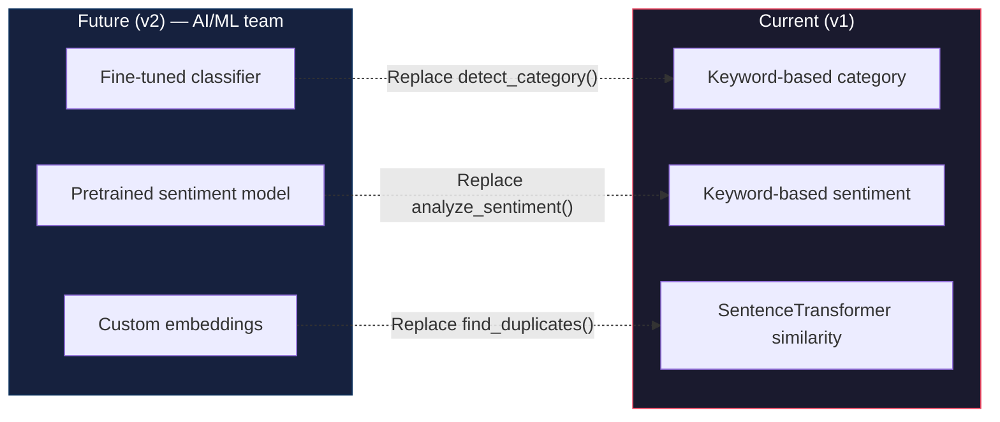

**Drop-in replacement contract** — AI/ML team only needs to match the function signatures:

```python
# detect_category(text: str) -> str
# analyze_sentiment(text: str) -> str
# find_duplicates(new_text, existing, threshold) -> (bool, int|None, float)
```

---

## 12. Development Phases & Timeline

### Phase 1: Foundation (Day 1)

| Person A | Person B |
|----------|----------|
| `database.py` — SQLite engine + session | `sentiment_engine.py` — keyword-based |
| `models.py` — Complaint model | `priority_engine.py` — scoring formula |
| `schemas.py` — All Pydantic models | `recommendation_engine.py` — lookup table |
| `crud.py` — All CRUD functions | `ai_engine.py` — skeleton with `detect_category()` |

### Phase 2: API + AI (Day 2)

| Person A | Person B |
|----------|----------|
| `routers/complaints.py` — all endpoints | `similarity.py` — SentenceTransformer integration |
| `routers/dashboard.py` — stats + analytics | `ai_engine.py` — full orchestrator |
| `main.py` — CORS + router wiring | Test AI functions standalone |

### Phase 3: Merge + Test (Day 3)

| Both |
|------|
| Wire `analyze_complaint()` into `POST /complaints` |
| Integration test: submit complaint → verify AI fields populated |
| Test all endpoints with `curl` / Swagger UI (`/docs`) |
| Fix CORS issues for frontend |

### Phase 4: Polish (Day 4)

| Both |
|------|
| Edge case handling (empty DB, missing fields, etc.) |
| Error responses (proper HTTP status codes) |
| `seed_data.py` — sample complaints for frontend dev |
| Documentation at `/docs` (auto-generated by FastAPI) |

---

## 13. Testing Strategy

### 13.1 Manual Testing with Swagger

FastAPI auto-generates docs at `http://localhost:8000/docs`. Test all endpoints interactively.

### 13.2 Curl Tests

```bash
# Health check
curl http://localhost:8000/health

# Submit complaint
curl -X POST http://localhost:8000/api/complaints \
  -H "Content-Type: application/json" \
  -d '{
    "name": "Test User",
    "title": "Broken street light",
    "description": "The street light on 5th Avenue has been broken for 3 days. It is very dangerous at night.",
    "location_name": "5th Avenue, Sector 12",
    "latitude": 12.97,
    "longitude": 77.59
  }'

# Get all complaints
curl http://localhost:8000/api/complaints

# Get dashboard stats
curl http://localhost:8000/api/dashboard/stats

# Test AI standalone
curl -X POST http://localhost:8000/api/ai/analyze \
  -H "Content-Type: application/json" \
  -d '{"text": "There is a massive pothole near the hospital. Someone got injured yesterday."}'
```

### 13.3 Unit Test Skeleton (`tests/test_ai_engine.py`)

```python
from ai_engine import analyze_complaint, detect_category


def test_detect_category_road():
    assert detect_category("There is a pothole on the road") == "Road"


def test_detect_category_water():
    assert detect_category("Water pipe is leaking badly") == "Water"


def test_analyze_complaint_returns_all_fields():
    result = analyze_complaint("Broken road near school", [])
    required_keys = {
        "category", "sentiment", "is_duplicate", "duplicate_of",
        "similarity_score", "priority_score", "priority_level", "recommended_action",
    }
    assert required_keys.issubset(result.keys())


def test_analyze_complaint_with_duplicates():
    existing = [
        {"id": 1, "description": "There is a pothole near the college"},
        {"id": 2, "description": "Water leakage in sector 5"},
    ]
    result = analyze_complaint("Road is badly damaged near the college gate", existing)
    assert result["is_duplicate"] is True
    assert result["duplicate_of"] == 1
```

### 13.4 Unit Test Skeleton (`tests/test_crud.py`)

```python
from sqlalchemy import create_engine
from sqlalchemy.orm import sessionmaker
from database import Base
from models import Complaint
from crud import create_complaint, get_complaint, get_all_complaints
from schemas import ComplaintCreate

TEST_ENGINE = create_engine("sqlite:///:memory:")
TestSession = sessionmaker(bind=TEST_ENGINE)
Base.metadata.create_all(bind=TEST_ENGINE)


def get_test_db():
    db = TestSession()
    try:
        yield db
    finally:
        db.close()


def test_create_and_get_complaint():
    db = TestSession()
    complaint = ComplaintCreate(
        name="Test",
        title="Test Title",
        description="Test Description",
        location_name="Test Location",
    )
    created = create_complaint(db, complaint)
    assert created.id is not None
    fetched = get_complaint(db, created.id)
    assert fetched.title == "Test Title"
    db.close()
```

---

## 14. Deployment & Runbook

### 14.1 Start the Backend

```bash
cd backend

# Install dependencies
pip install -r requirements.txt

# Run the server
uvicorn main:app --reload --host 0.0.0.0 --port 8000
```

### 14.2 Verify

- Swagger UI: `http://localhost:8000/docs`
- Health: `http://localhost:8000/health`
- Database: `civicmind.db` created automatically on first run

### 14.3 Environment Variables (Future)

```env
DATABASE_URL=sqlite:///./civicmind.db
CORS_ORIGINS=http://localhost:5173,http://localhost:3000
AI_MODEL_THRESHOLD=0.70
```

### 14.4 Common Issues

| Issue | Fix |
|-------|-----|
| `ModuleNotFoundError: ai_engine` | Ensure you're running from `backend/` directory |
| CORS errors from frontend | Check `allow_origins` in `main.py` matches frontend URL |
| `sentence-transformers` slow first load | Model downloads on first use (~80MB); subsequent loads use cache |
| SQLite locked errors | Ensure `check_same_thread=False` in engine config |
| Port already in use | `uvicorn main:app --port 8001` |

---

## Quick Reference Card

```
Person A: main.py, database.py, models.py, schemas.py, crud.py, routers/*
Person B: ai_engine.py, similarity.py, priority_engine.py, sentiment_engine.py, recommendation_engine.py
Contract: analyze_complaint(text, existing) -> dict
Port:     8000
Docs:     http://localhost:8000/docs
DB:       civicmind.db (auto-created)
```
